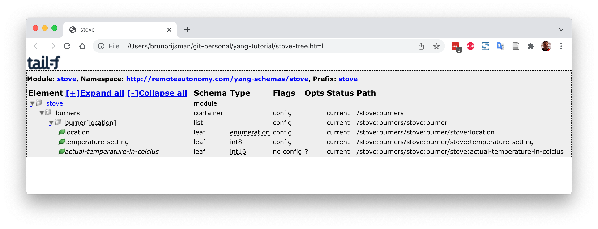
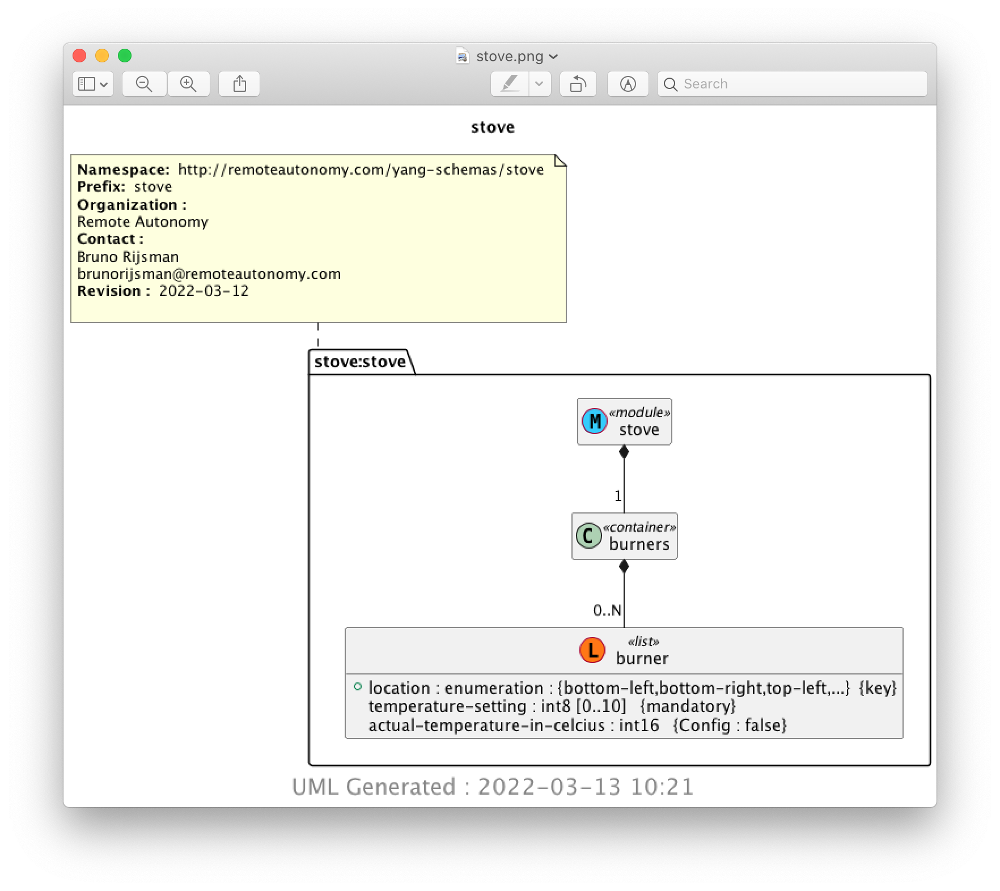

--== **A WORK IN PROGRESS** ==--

# A scenic tour through the YANG ecosystem

In this tutorial we will take a hands-on scenic tour through the YANG related ecosystem:

 * Write a simple YANG data model to manage a set of interfaces.

 * Use [pyang](https://github.com/mbj4668/pyang) to validate the YANG data model and to convert it
   to various other formats.

 * Use [clixon](https://clixon-docs.readthedocs.io/en/latest/) to implement a server that:
   - Implements the YANG data model.
   - Provides a command line interface (CLI).
   - Provides a NETCONF interface.
   - Provides a RESTCONF interface.
   - Initially provides a mocked backend for fake interfaces.
   - Later on provides a real backend for real interfaces on a Linux host.

* Use the clixon CLI client to access the command line interface provided by the clixon server.

* Use the [MGSoft](https://www.mg-soft.si/) [NETCONF browser](https://www.mg-soft.si/) to access
  the NETCONF interface provided by the clixon server.

* Use [ncclient](https://github.com/ncclient/ncclient) as a NETCONF client of the NETCONF
  interface provided by the clixon server.

 * Use the basic version of [Tail-f](https://www.tail-f.com/)
   [CONFD](https://www.tail-f.com/confd-basic/) to implement a server that:
   - Implements the YANG data model.
   - Provides a command line interface (CLI).
   - Provides a NETCONF interface.
   - Initially provides a mocked backend for fake interfaces.
   - Later on provides a real backend for real interfaces on a Linux host.

## Write a YANG data model

We are going to start by writing a very simple little YANG data model that we will use throughout
the remainder of this tutorial.

Our data model manages the interfaces on a device. It contains a list of interfaces, and each
interface has a name, an IPv4 address, and counters for the number of sent and received
packets.

In real life, the data models for managing interfaces 
([RFC 8343](https://www.rfc-editor.org/rfc/pdfrfc/rfc8343.txt.pdf))
and for managing IP addresses
([RFC 8344](https://www.rfc-editor.org/rfc/pdfrfc/rfc8344.txt.pdf))
are way more complex, but we are using a simplistic data model in this tutorial to keep the
example code short and easy to understand.

Here is our data model (you can find it in this repository in the file `tutorial-interfaces.yang`):

```
module stove {

    namespace "http://remoteautonomy.com/yang-schemas/tutorial-interfaces";
    prefix ra-tutin;

    organization
      "Remote Autonomy";

    contact
      "Bruno Rijsman
       brunorijsman@remoteautonomy.com";

    description
        "This is simple data model for the tutorial.";

    revision 2022-03-12 {
        description
          "Initial revision.";
    }

    container interfaces {
        description
          "Interface parameters.";

        list interface {
            key "name";
            description
              "The list of interfaces on the device.";

            leaf name {
                type string;
                description
                  "The name of the interface.";
            }

            leaf ipv4-address {
                type string;
                description
                  "The IPv4 address of the interface.";
            }

            leaf sent-packets {
                type uint64;
                description
                  "The number of IPv4 packets sent out over this interface";
            }

            leaf received-packets {
                type uint64;
                description
                  "The number of IPv4 packets received over this interface";
            }
        }
    }
}
```

## Pyang

[Pyang](https://github.com/mbj4668/pyang) is an open source YANG validator, transformer, and
code generator, written in Python.

To install pyang follow the 
[pyang installation instructions](#pyang-installation-instructions)
at the end of this tutorial.

The simplest way of using pyang is to validate the correctness of a YANG data model:

<pre>
$ <b>pyang stove.yang</b>
</pre>

Since the data model is correct, this produces no output.

Changing the `organization` statement to the British spelling `organisation` produces the following
error message:

<pre>
$ <b>pyang stove.yang</b>
stove.yang:7: error: unexpected keyword "organisation"
</pre>

Produce a textual tree diagram of the YANG data model:

<pre>
$ <b>pyang -f tree stove.yang</b>
module: stove
  +--rw burners
     +--rw burner* [location]
        +--rw location                         enumeration
        +--rw temperature-setting              int8
        +--ro actual-temperature-in-celcius?   int16
</pre>

The command `pyang --tree-help` displays an explanation of the symbols in the tree diagram.

Produce a javascript tree diagram of the YANG data model for viewing in a web browser:

<pre>
$ <b>pyang -f jstree stove.yang > stove.html</b>
$ <b>open stove.html</b>
</pre>



Produce a UML diagram of the YANG data model (this requires [PlantUML](https://plantuml.com/)
to be installed):

<pre>
$ <b>pyang -f uml stove.yang > stove.uml</b>
$ <b>plantuml stove.uml</b>
$ <b>open img/stove.png</b>
</pre>



```
Convert to FORMAT.  Supported formats are: 
identifiers,
sample-xml-skeleton, capability, jsonxsl, depend,
jtox, name
```


# Installation instructions

All of the installation instructions below are for Ubuntu 12.04.

## Cloning and setting up this repository

Clone this repository:

<pre>
$ <b>git clone https://github.com/brunorijsman/yang-tutorial.git</b>
Cloning into 'yang-tutorial'...
remote: Enumerating objects: 32, done.
remote: Counting objects: 100% (32/32), done.
remote: Compressing objects: 100% (21/21), done.
remote: Total 32 (delta 8), reused 29 (delta 5), pack-reused 0
Unpacking objects: 100% (32/32), 848.05 KiB | 1.58 MiB/s, done.
</pre>

In the remainder of this tutorial I will assume that you cloned the repository into your home
directory. If not, replace `~` with whatever directory you cloned the repository into.

## Setting up a python virtual environment

Make sure you have version 3.8 or higher of Python installed:

<pre>
$ <b>python3 --version</b>
Python 3.8.10
</pre>

Create a Python virtual environment:

<pre>
$ <b>cd yang-tutorial</b>
$ <b>python3 -m venv venv</b>
</pre>

Activate the Python virtual environment:

<pre>
$ <b>source venv/bin/activate</b>
(venv) $
</pre>

Install the Python dependencies:

<pre>
$ <b>pip install -r requirements.txt</b>
Collecting lxml==4.8.0
  Using cached lxml-4.8.0-cp38-cp38-manylinux_2_17_x86_64.manylinux2014_x86_64.manylinux_2_24_x86_64.whl (6.9 MB)
Collecting pyang==2.5.2
  Using cached pyang-2.5.2-py2.py3-none-any.whl (595 kB)
Installing collected packages: lxml, pyang
Successfully installed lxml-4.8.0 pyang-2.5.2
</pre>

## Pyang installation instructions

If you haven't already done so, follow the instructions for
[cloning and setting up this repository](#cloning-and-setting-up-this-repository)
and the instructions for
[setting up a python virtual environment](#setting-up-a-python-virtual-environment).

If you already did these installation steps previously, don't forget to reactivate your Python
virtual environment if it isn't already active:

<pre>
$ <b>cd ~/yang-tutorial</b>
$ <b>source venv/bin/activate</b>
(env) $
</pre>

If you followed the above installation instructions, the `pyang` Python package was already
installed as part of installing the Python dependencies.

If for some reason you want to install `pyang` separately, use the following command:

<pre>
$ <b>pip install pyang</b>
</pre>

To verify that `pyang` is properly installed:

<pre>
$ <b>pyang --version</b>
pyang 2.5.2
</pre>

## Clixon installation instructions

TODO

## Cclient installation instructions

TODO

## 

# References

## YANG

## NETMOD

* [The IETF NETMOD working group](https://datatracker.ietf.org/wg/netmod/about/)
* [The IETF NETMOD standards](https://datatracker.ietf.org/wg/netmod/documents/)

## NETCONF

* [The IETF NETCONF working group](https://datatracker.ietf.org/wg/netconf/about/)
* [The IETF NETCONF standards](https://datatracker.ietf.org/wg/netconf/documents/)

## RESTCONF

## Pyang

* [The pyang GitHub repository](https://github.com/mbj4668/pyang)
* [A pyang tutorial](https://www.ietf.org/slides/slides-edu-pyang-tutorial-01.pdf)

## Clixon

* [The clixon GitHub repository](https://github.com/clicon/clixon)
* [Clixon documentation](https://clixon-docs.readthedocs.io/en/latest/)

## Ncclient

## MG-Soft NETCONF browser

## Tail-f CONFD

* [The tail-f company homepage (a Cisco company)](https://www.tail-f.com/)
* [The CONFD basic product homepage](https://www.tail-f.com/confd-basic/)
* [The CONFD premium product homepage](https://www.tail-f.com/management-agent/)


