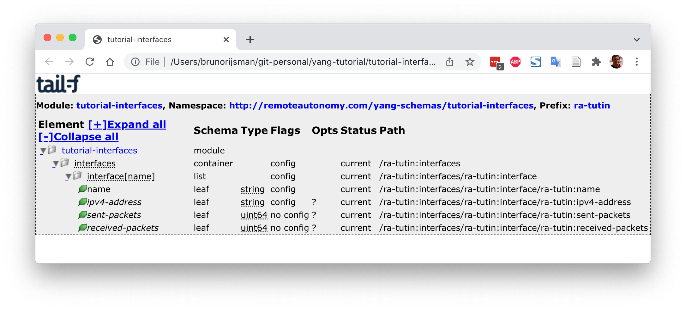
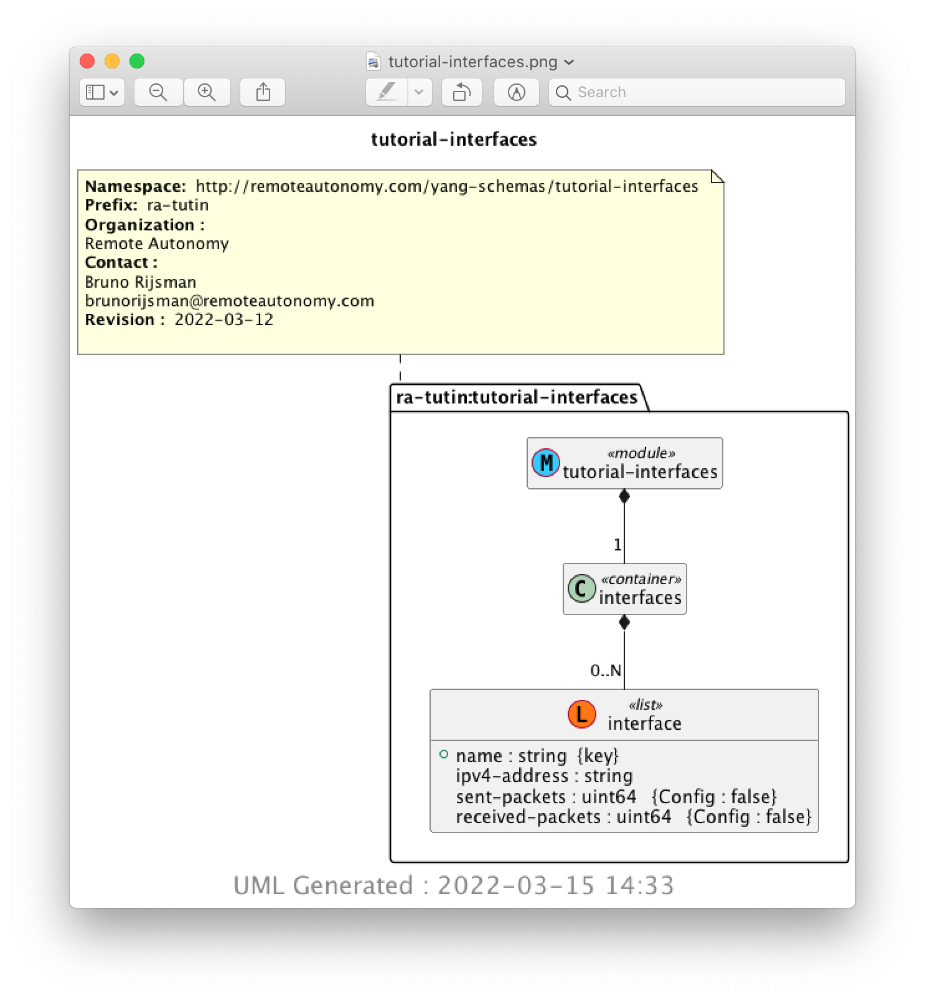

--== **A WORK IN PROGRESS** ==--

# A scenic tour through the YANG ecosystem

In this tutorial we will take a hands-on scenic tour through the YANG related ecosystem:

 * Write a simple YANG data model to manage a set of interfaces.

 * Use [pyang](https://github.com/mbj4668/pyang) to validate the YANG data model and to convert it
   to various other formats.

 * Use [clixon](https://clixon-docs.readthedocs.io/en/latest/) to implement a server that:
   - Implements the YANG data model.
   - Provides a command line interface (CLI).
   - Provides a NETCONF interface.
   - Provides a RESTCONF interface.
   - Initially provides a mocked backend for fake interfaces.
   - Later on provides a real backend for real interfaces on a Linux host.

* Use the clixon CLI client to access the command line interface provided by the clixon server.

* Use the [MGSoft](https://www.mg-soft.si/) [NETCONF browser](https://www.mg-soft.si/) to access
  the NETCONF interface provided by the clixon server.

* Use [ncclient](https://github.com/ncclient/ncclient) as a NETCONF client of the NETCONF
  interface provided by the clixon server.

* Use the basic version of [Tail-f](https://www.tail-f.com/)
   [CONFD](https://www.tail-f.com/confd-basic/) to implement a server that:
   - Implements the YANG data model.
   - Provides a command line interface (CLI).
   - Provides a NETCONF interface.
   - Initially provides a mocked backend for fake interfaces.
   - Later on provides a real backend for real interfaces on a Linux host.

* TODO: Add a YumaPro basic example.

* TODO: Add a Sysrepo example.

## Write a YANG data model

We are going to start by writing a very simple little YANG data model that we will use throughout
the remainder of this tutorial.

Our data model manages the interfaces on a device. It contains a list of interfaces, and each
interface has a name, an IPv4 address, and counters for the number of sent and received
packets.

In real life, the data models for managing interfaces
([RFC 8343](https://www.rfc-editor.org/rfc/pdfrfc/rfc8343.txt.pdf))
and for managing IP addresses
([RFC 8344](https://www.rfc-editor.org/rfc/pdfrfc/rfc8344.txt.pdf))
are way more complex, but we are using a simplistic data model in this tutorial to keep the
example code short and easy to understand.

Here is our data model (you can find it in this repository in the file `interfaces.yang`):

```
[TODO] @@@ Paste updated data model
[TODO] @@@ Paste updated figures
module interfaces {

    namespace "http://remoteautonomy.com/yang-schemas/interfaces";
    prefix ra-tutin;

    organization
      "Remote Autonomy";

    contact
      "Bruno Rijsman
       brunorijsman@remoteautonomy.com";

    description
        "This is simple data model for the tutorial.";

    revision 2022-03-12 {
        description
          "Initial revision.";
    }

    container interfaces {
        description
          "Interface parameters.";

        list interface {
            key "name";
            description
              "The list of interfaces on the device.";

            leaf name {
                type string;
                description
                  "The name of the interface.";
            }

            leaf ipv4-address {
                type string;
                description
                  "The IPv4 address of the interface.";
            }

            leaf sent-packets {
                type uint64;
                config false;
                description
                  "The number of IPv4 packets sent out over this interface";
            }

            leaf received-packets {
                type uint64;
                config false;
                description
                  "The number of IPv4 packets received over this interface";
            }
        }
    }
}
```

## Pyang

[Pyang](https://github.com/mbj4668/pyang) is an open source YANG validator, transformer, and
code generator, written in Python.

To install pyang follow the
[pyang installation instructions](#pyang-installation-instructions)
at the end of this tutorial.

The simplest way of using pyang is to validate the correctness of a YANG data model:

<pre>
$ <b>pyang interfaces.yang</b>
</pre>

The fact that we get no output means that the YANG file was correct. In addition, the program
returns status code zero, so you can do something like this:

<pre>
$ <b>if pyang interfaces.yang; then echo "All good"; else "There are errors"; fi</b>
All good
</pre>

Just to see what happens if there is an error, edit the YANG file and change the word
`organization` to its British spelling `organisation`
(don't forget to change it back afterwards):

<pre>
$ <b>pyang interfaces.yang</b>
interfaces.yang:7: error: unexpected keyword "organisation"
</pre>

YANG data models tend to be very long and verbose. Pyang can produce a summary of the YANG data
model in a tree format:

<pre>
$ <b>pyang -f tree interfaces.yang</b>
module: interfaces
  +--rw interfaces
     +--rw interface* [name]
        +--rw name                string
        +--rw ipv4-address?       string
        +--ro sent-packets?       uint64
        +--ro received-packets?   uint64
</pre>

The command `pyang --tree-help` displays an explanation of the symbols in the tree diagram.

In addition to producing a tree summary, Pyang can also convert the YANG data model to many other
formats:

<pre>
$ <b>pyang --help</b>
Usage: pyang [options] [<filename>...]

Validates the YANG module in <filename> (or stdin), and all its dependencies.

Options:
  -h, --help            Show this help message and exit
[...]
  -f FORMAT, --format=FORMAT
                        Convert to FORMAT.  Supported formats are: yang, yin,
                        dsdl, omni, tree, jstree, flatten, uml, identifiers,
                        sample-xml-skeleton, capability, jsonxsl, depend,
                        jtox, name
[...]
</pre>

We will give just a couple of examples of interesting format conversions.

Use the following command to produce an HTML file that describes the YANG data model
(`jstree` stands for JavaScript tree):

<pre>
$ <b>pyang -f jstree interfaces.yang > interfaces.html</b>
</pre>

Use any web browser to view the produced HTML file. Here we assume that you are running Ubuntu and
that you can start `firefox` from command line (on macOS use `open interfaces.html`):

<pre>
$ <b>firefox interfaces.html</b>
</pre>



Another interesting option is to convert the YANG data model into a UML diagram:

<pre>
$ <b>pyang -f uml interfaces.yang > interfaces.uml</b>
</pre>

You need to have `plantuml` installed (see
[pyang installation instructions](#pyang-installation-instructions)
) to convert the produced UML text file to a graphical PNG file:

<pre>
$ <b>plantuml interfaces.uml</b>
</pre>

The PNG file can be viewed in a web browser:

<pre>
$ <b>firefox img/interfaces.png</b>
</pre>



## Clixon: Introduction

[Clixon](https://github.com/clicon/clixon) can generate a server from a YANG data model.

The generated server provides multiple north-bound interfaces based on the YANG data model:
* A command line interface (CLI).
* A NETCONF interface.
* A RESTCONF interface.

Clixon also provides a software development kit (SDK) that allows you to develop plugins
that implement the backend of the YANG data model, such as:
* Retrieve the values for operational attributes from the underlying hardware when a
  NETCONF get / RESTCONF get / CLI show operation is performed.
* Make the values for configuration attributes take effect in the underlying hardware when a
  NETCONF set / RESTCONF put / CLI set operation is performed.

The following figure shows the clixon architecture:


Clixon is an open source project implemented in C. 
You can think of Clixon as being the open source equivalent of the commercial
[CONFD](https://www.tail-f.com/management-agent/) product from [Tail-F](https://www.tail-f.com/)
or the YumaPro product suite from [YumaWorks](https://www.yumaworks.com/).

## Clixon: Building the backend server

We will now explain how to build the clixon backend server for the `interfaces.yang` data model
that we introduced earlier in this tutorial.

First install clixon following the
[clixon installation instructions](#clixon-installation-instructions)
at the end of this tutorial.

Change the current directory to the `clixon` directory in this repository:

<pre>
$ <b>cd ~/yang-tutorial/clixon</b>
</pre>

This directory contains the following:

<pre>
$ <b>ls -1</b>
interfaces_cli.cli
interfaces.xml
Makefile
plugins/
startup_db
</pre>

These files have the following functions:
* File `interfaces.xml` is the the configuration file for the Clixon backend daemon.
* File `interfaces_cli.cli` is the configuration file for the Clixon CLI daemon.
* File `startup_db` contains startup configuration datastore.
* Directory `plugins` contains tutorial code for the backend plugins (we will get to this later).
* File `Makefile` contains the rules for building and installing Clixon.

We will first run clixon without any plugins.
Since there are no plugins yet, we don't have to compile any code.
For now, the only thing we have to do is to install the clixon configuration files in the proper
directories.
This is achieved by running `make install` as a super user:

<pre>
$ <b>sudo make install</b>
install -d -m 0755 /usr/local/etc
install -m 0644 interfaces.xml /usr/local/etc
install -d -m 0755 /usr/local/lib/interfaces
install -d -m 0755 /usr/local/lib/interfaces/clispec
install -m 0644 interfaces_cli.cli /usr/local/lib/interfaces/clispec
install -d -m 0755 /usr/local/var
install -d -m 0755 /usr/local/var/interfaces
install -m 0644 startup_db /usr/local/var/interfaces/
install -d -m 0755 /usr/local/share/clixon
install -m 0644 ../interfaces.yang /usr/local/share/clixon
</pre>

Start the clixon backend daemon:

<pre>
$ <b>sudo clixon_backend -f interfaces.xml</b>
</pre>

Verify that the clixon backend daemon is actually running:

<pre>
$ <b>ps aux | grep clixon</b>
root       47277  0.0  0.0   4596  3388 ?        Ss   15:27   0:00 clixon_backend -f interfaces.xml
paralle+   47504  0.0  0.0   9040   740 pts/0    S+   15:28   0:00 grep --color=auto clixon
</pre>

If you ever want to restart the clixon backend daemon, you first have to stop the old daemon first
using the `-z` command line option (don't do this now):

<pre>
$ <b>sudo clixon_backend -f interfaces.xml -z</b>
Mar 16 15:50:42: Killing old daemon with pid: 47277
</pre>

## Clixon: CLI configuration

Start the clixon command line interface (CLI) frontend:

<pre>
$ <b>clixon_cli -f interfaces.xml</b>
cli>
</pre>

The `cli>` prompt indicates that we are now in the clixon CLI that was automatically generated from
`interfaces.yang` data model in combination with the `interfaces_cli.cli` configuration file.

Type `?` to get a list of available CLI commands:

<pre>
cli> <b>?</b>
  commit                Commit the changes
  compare               Compare running and candidate
  create                Create a configuration item
  debug                 Debugging parts of the system
  delete                Delete a configuration item
  discard               Discard edits (rollback 0)
  load                  Load configuration from XML file
  merge                 Merge configuration items
  mode                  Enter a configuration mode
  no                    Negate or remove
  quit                  Quit
  save                  Save candidate configuration to XML file
  set                   Set a configuration item value
  show                  Show a particular state of the system
  startup               Store running as startup config
  top                   Move to the top level in the configuration
  up                    Move one level up in the configuration
  validate              Validate changes
cli>
</pre>

If we do a `show configuration` at this point, we get no output because we have not yet configured
any interfaces:

<pre>
cli> <b>show configuration</b>
cli> 
</pre>

Configure IPv4 address `10.0.0.99` on the loopback interface `lo`:

<pre>
cli> <b>set interfaces interface lo ipv4-address 10.0.0.99</b>
cli> 
</pre>

The configuration that we just added has not yet taken effect:
at this point it is just a candidate configuration and not yet a running configuration.

Use the commit command to make the configuration take effect, in other words to make the
candidate configuration the running configuration
(later, when we implement the backend plugin we will see that committing the configuration
causes the IPv4 address on the real interface to change):

<pre>
cli> <b>commit</b>
cli> 
</pre>

If you try to configure some attribute that is not defined in the YANG data model
(`ipv6-address` in this example), 
you get an error. This is the simplest example of configuration validation based on the YANG data model:

<pre>
cli> <b>set interfaces interface lo ipv6-address ::10</b>
CLI syntax error: "set interfaces interface lo ipv6-address ::10": Unknown command
</pre>

If you try to configure an invalid IPv4 address, you also get an error.

<pre>
cli> <b>set interfaces interface lo ipv4-address ::10</b>
CLI syntax error: "set interfaces interface lo ipv4-address ::10": "::10" is invalid input for cli command: ipv4-address
</pre>

This is more sophisticated example of configuration validation based on the YANG data model.
In this example, the invalid IPv4 address `::10` is rejected by the CLI because it does not match
the regular expression in the YANG data model:

<pre>
leaf ipv4-address {
    type string {
        <b>pattern '([0-9]+.){3}.[0-9]+';</b>
    }
    description
      "The IPv4 address of the interface.";
}
</pre>

Note that we used a simplistic regular expression that will still accept invalid IPv4 addresses
(for example "999.999.999.999"). 
The IETF standard YANG data models for IP addresses contain more sophisticated regular expressions.

Now configure the IPv4 address of a second interface `eth0`.
In this case, instead of specifying the full path of the configured attribute in the `set` command,
we navigate to the desired attribute using the `mode` command:

<pre>
cli> <b>mode interfaces</b>
cli> <b>mode interface</b>
cli> <b>mode eth0</b>
cli> <b>set ipv4-address 10.0.0.98</b>
cli> 
</pre>

In addition to the `mode` command, we can also use the `up` and `top` commands to navigate through
the levels in the configuration hierarchy:

<pre>
cli> <b>set ?</b> 
  ipv4-address          The IPv4 address of the interface.
cli> <b>up</b>
cli> <b>set ?</b>
  interface             The list of interfaces on the device.
cli> <b>top</b>
cli> <b>set ?</b>
  interfaces            Interface parameters.
</pre>

Recall that we have only added this second interface to the candidate configuration;
not yet to the running configuration.

Before we commit, we can use the `compare` command to see what the difference is between the
candidate configuration and the running configuration, in other words which configuration changes
have not yet been committed:

<pre>
cli> compare
     interface {
+        name eth0;
+        ipv4-address 10.0.0.98;
+    }
+    interface {
         name lo;
</pre>

Note that the comparison looks a bit strange, because the `diff` algorithm in clixon does a simple
text comparison which doesn't understand whether the first `interface {` line or the second 
`interface {` line was added.

Now commit the candidate configuration:

<pre>
cli> <b>commit</b>
cli>
</pre>

Now, when we do `show configuration` we see both configured interfaces:

```
cli> <b>show configuration</b>
interfaces {
    interface {
        name eth0;
        ipv4-address 10.0.0.98;
    }
    interface {
        name lo;
        ipv4-address 10.0.0.99;
    }
}
cli> 
```

We can also look at the configuration other formats such as XML or JSON:

```
cli> <b>show configuration xml</b>
<interfaces xmlns="http://remoteautonomy.com/yang-schemas/interfaces">
   <interface>
      <name>eth0</name>
      <ipv4-address>10.0.0.98</ipv4-address>
   </interface>
   <interface>
      <name>lo</name>
      <ipv4-address>10.0.0.99</ipv4-address>
   </interface>
</interfaces>
```

```
cli> <b>show configuration json</b>
{
  "ietf-restconf:data": {
    "interfaces:interfaces": {
      "interface": [
        {
          "name": "eth0",
          "ipv4-address": "10.0.0.98"
        },
        {
          "name": "lo",
          "ipv4-address": "10.0.0.99"
        }
      ]
    }
  }
}
```

Use the `quit` command to exit the CLI and return to the Linux shell:

<pre>
cli> <b>quit</b>
$
</pre>

## Clixon: A fake backend plugin

We will now implemented a fake backend plugin.
It is fake in the sense that it will just swallow any configured IPv4 address without applying
it to a real interface,
and it will just return random values for the packet counters instead of reading the real counters
from the real interfaces.
Later, we will convert the fake plugin with a real plugin that configures and reads the real
interfaces.
But for now, we start simple and focus on the APIs provided by clixon.

**TODO: Continue from here**

Start the `clixon_backend` daemon. I like to run it with verbose logging to ease debugging.
Note that there is *no* ampersand (`&`) needed at the end of this command.

<pre>
$ <b>sudo clixon_backend -f interfaces.xml -lf/var/log/clixon.log -D 1</b>
</pre>


# Installation instructions

All of the installation instructions below are for Ubuntu 12.04.

## Cloning and setting up this repository

Clone this repository:

<pre>
$ <b>git clone https://github.com/brunorijsman/yang-tutorial.git</b>
Cloning into 'yang-tutorial'...
remote: Enumerating objects: 32, done.
remote: Counting objects: 100% (32/32), done.
remote: Compressing objects: 100% (21/21), done.
remote: Total 32 (delta 8), reused 29 (delta 5), pack-reused 0
Unpacking objects: 100% (32/32), 848.05 KiB | 1.58 MiB/s, done.
</pre>

In the remainder of this tutorial I will assume that you cloned the repository into your home
directory. If not, replace `~` with whatever directory you cloned the repository into.

## Setting up a python virtual environment

Make sure that we have version 3.8 or higher of Python installed:

<pre>
$ <b>python3 --version</b>
Python 3.8.10
</pre>

Create a Python virtual environment:

<pre>
$ <b>cd yang-tutorial</b>
$ <b>python3 -m venv venv</b>
</pre>

Activate the Python virtual environment:

<pre>
$ <b>source venv/bin/activate</b>
(venv) $
</pre>

Install the Python dependencies:

<pre>
$ <b>pip install -r requirements.txt</b>
Collecting lxml==4.8.0
  Using cached lxml-4.8.0-cp38-cp38-manylinux_2_17_x86_64.manylinux2014_x86_64.manylinux_2_24_x86_64.whl (6.9 MB)
Collecting pyang==2.5.2
  Using cached pyang-2.5.2-py2.py3-none-any.whl (595 kB)
Installing collected packages: lxml, pyang
Successfully installed lxml-4.8.0 pyang-2.5.2
</pre>

## Pyang installation instructions

If you haven't already done so, follow the instructions for
[cloning and setting up this repository](#cloning-and-setting-up-this-repository)
and the instructions for
[setting up a python virtual environment](#setting-up-a-python-virtual-environment).

If you already did these installation steps previously, don't forget to reactivate your Python
virtual environment if it isn't already active:

<pre>
$ <b>cd ~/yang-tutorial</b>
$ <b>source venv/bin/activate</b>
(env) $
</pre>

If you followed the above installation instructions, the `pyang` Python package was already
installed as part of installing the Python dependencies.

If for some reason you want to install `pyang` separately, use the following command:

<pre>
$ <b>pip install pyang</b>
</pre>

Verify that `pyang` is properly installed:

<pre>
$ <b>pyang --version</b>
pyang 2.5.2
</pre>

One of the examples in the tutorial converts the YANG data model into a UML diagram.
This requires [PlantUML](https://plantuml.com/) to be installed:

<pre>
$ <b>sudo apt install -y plantuml</b>
[...]
</pre>

## Clixon installation instructions

[Clixon](https://github.com/clicon/clixon) is an open source project written in C that offers a
YANG-based configuration data store with plugin APIs for configuration consuming applications and 
with CLI, NETCONF, and RESTCONF frontend interfaces.

TODO: Install dependencies. Use a fresh Ubuntu virtual machine to get the exact steps right.

Clone the `clixon` GitHub repository:

<pre>
$ <b>cd ~</b>

$ <b>git clone https://github.com/clicon/clixon.git</b>
Cloning into 'clixon'...
[...]
</pre>

Build `clixon`:

<pre>
$ <b>cd clixon</b>

$ <b>./configure</b>
debug is no
checking for gcc... gcc
[...]
config.status: creating include/clixon_config.h
config.status: creating lib/clixon/clixon.h

$ <b>make</b>
(cd include && make  all)
make[1]: Entering directory '/home/parallels/test/clixon/include'
[...]
/usr/bin/id
After 'make install' as euid root, build example app and test utils: 'make example'

$ <b>sudo make install</b>
/usr/bin/id
for i in include lib  apps etc yang  doc; \
[...]
To install example app and test utils: make install-example
make[1]: Leaving directory '/home/parallels/test/clixon'
</pre>

We will explain how to start the clixon backend server and the clixon frontend servers for the
CLI, for NETCONF, and for RESTCONF in the main body of the tutorial.

## MG-Soft NETCONF browser instructions

[MG-Soft](https://www.mg-soft.si/) is a company that offers a suite of network management related
products.
One of their products, the [NETCONF browser](https://www.mg-soft.si/mgNetConfBrowser.html) is a
NETCONF client that can connect to a NETCONF server and that offers a graphical user interface
for exploring and editing the data store in the NETCONF server.

You can download the NETCONF browser from the 
[download page](https://www.mg-soft.si/download.html?product=netconfbrowser)
on the MG-Soft website.

MG-Soft offers a version of the NETCONF browser that runs natively on Linux, but I find it more
convenient to run the macOS version of the NETCONF browser and connect to the NETCONF server that
runs inside my Ubuntu virtual machine over the bridge network.

To do anything interesting with the NETCONF browser, you will need to apply a license key.
You can [purchase a license online](https://www.mg-soft.si/mgNetConfBrowser-ordering.html)
or you can [request a 30-day evaluation license online](https://www.mg-soft.si/evalKeyReq.html).
Note: I am not affiliated with MG-Soft in any way and I don't get any commission.

## Ncclient installation instructions

[Ncclient](https://github.com/ncclient/ncclient) (short for NETCONF Client) @@@

##

# References

## YANG

## NETMOD

* [The IETF NETMOD working group](https://datatracker.ietf.org/wg/netmod/about/)
* [The IETF NETMOD standards](https://datatracker.ietf.org/wg/netmod/documents/)

## NETCONF

* [The IETF NETCONF working group](https://datatracker.ietf.org/wg/netconf/about/)
* [The IETF NETCONF standards](https://datatracker.ietf.org/wg/netconf/documents/)

## RESTCONF

## Pyang

* [The pyang GitHub repository](https://github.com/mbj4668/pyang)
* [A pyang tutorial](https://www.ietf.org/slides/slides-edu-pyang-tutorial-01.pdf)
* [The PlantUML home page](https://plantuml.com/)

## Clixon

* [The clixon GitHub repository](https://github.com/clicon/clixon)
* [The clixon examples GitHub repository](https://github.com/clicon/clixon-examples)
* [Clixon documentation](https://clixon-docs.readthedocs.io/en/latest/)

## Ncclient

## MG-Soft NETCONF browser
 * [The MG-Soft company homepage](https://www.mg-soft.si/)
 * [The MG-Soft NETCONF browser product page](https://www.mg-soft.si/mgNetConfBrowser.html)

## Tail-f CONFD

* [The tail-f company homepage (a Cisco company)](https://www.tail-f.com/)
* [The CONFD basic product homepage](https://www.tail-f.com/confd-basic/)
* [The CONFD premium product homepage](https://www.tail-f.com/management-agent/)


