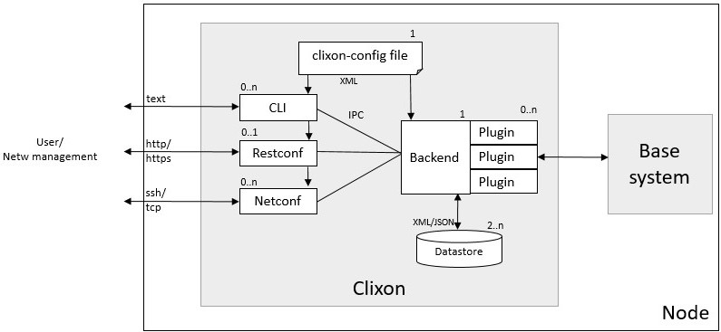

# Clixon: an open source NETCONF server

## Clixon: Introduction

[Clixon](https://github.com/clicon/clixon) can generate a server from a YANG data model.

The generated server provides multiple north-bound interfaces based on the YANG data model:
* A command line interface (CLI).
* A NETCONF interface.
* A RESTCONF interface.

Clixon also provides a software development kit (SDK) that allows you to develop plugins
that implement the backend of the YANG data model, such as:
* Retrieve the values for operational attributes from the underlying hardware when a
  NETCONF get / RESTCONF get / CLI show operation is performed.
* Make the values for configuration attributes take effect in the underlying hardware when a
  NETCONF set / RESTCONF put / CLI set operation is performed.

The following figure shows the clixon architecture:



Clixon is an open source project implemented in C. 
You can think of Clixon as being the open source equivalent of the commercial
[CONFD](https://www.tail-f.com/management-agent/) product from [Tail-F](https://www.tail-f.com/)
or the YumaPro product suite from [YumaWorks](https://www.yumaworks.com/).

## Clixon: Building the backend server

We will now explain how to build the clixon backend server for the `interfaces.yang` data model
that we introduced earlier in this tutorial.

First install clixon following the
[clixon installation instructions](#clixon-installation-instructions)
at the end of this tutorial.

Change the current directory to the `clixon` directory in this repository:

<pre>
$ <b>cd ~/yang-tutorial/clixon</b>
</pre>

This directory contains the following:

<pre>
$ <b>ls -1</b>
interfaces_cli.cli
interfaces.xml
Makefile
plugins/
startup_db
</pre>

These files have the following functions:
* File `interfaces.xml` is the the configuration file for the Clixon backend daemon.
* File `interfaces_cli.cli` is the configuration file for the Clixon CLI daemon.
* File `startup_db` contains startup configuration datastore.
* Directory `plugins` contains tutorial code for the backend plugins (we will get to this later).
* File `Makefile` contains the rules for building and installing Clixon.

We will first run clixon without any plugins.
Since there are no plugins yet, we don't have to compile any code.
For now, the only thing we have to do is to install the clixon configuration files in the proper
directories.
This is achieved by running `make install` as a super user:

<pre>
$ <b>sudo make install</b>
install -d -m 0755 /usr/local/etc
install -m 0644 interfaces.xml /usr/local/etc
install -d -m 0755 /usr/local/lib/interfaces
install -d -m 0755 /usr/local/lib/interfaces/clispec
install -m 0644 interfaces_cli.cli /usr/local/lib/interfaces/clispec
install -d -m 0755 /usr/local/var
install -d -m 0755 /usr/local/var/interfaces
install -m 0644 startup_db /usr/local/var/interfaces/
install -d -m 0755 /usr/local/share/clixon
install -m 0644 ../interfaces.yang /usr/local/share/clixon
</pre>

Start the clixon backend daemon:

<pre>
$ <b>sudo clixon_backend -f interfaces.xml</b>
</pre>

Verify that the clixon backend daemon is actually running:

<pre>
$ <b>ps aux | grep clixon</b>
root       47277  0.0  0.0   4596  3388 ?        Ss   15:27   0:00 clixon_backend -f interfaces.xml
paralle+   47504  0.0  0.0   9040   740 pts/0    S+   15:28   0:00 grep --color=auto clixon
</pre>

If you ever want to restart the clixon backend daemon, you first have to stop the old daemon first
using the `-z` command line option (don't do this now):

<pre>
$ <b>sudo clixon_backend -f interfaces.xml -z</b>
Mar 16 15:50:42: Killing old daemon with pid: 47277
</pre>

## Clixon: CLI configuration

Start the clixon command line interface (CLI) frontend:

<pre>
$ <b>clixon_cli -f interfaces.xml</b>
cli>
</pre>

The `cli>` prompt indicates that we are now in the clixon CLI that was automatically generated from
`interfaces.yang` data model in combination with the `interfaces_cli.cli` configuration file.

Type `?` to get a list of available CLI commands:

<pre>
cli> <b>?</b>
  commit                Commit the changes
  compare               Compare running and candidate
  create                Create a configuration item
  debug                 Debugging parts of the system
  delete                Delete a configuration item
  discard               Discard edits (rollback 0)
  load                  Load configuration from XML file
  merge                 Merge configuration items
  mode                  Enter a configuration mode
  no                    Negate or remove
  quit                  Quit
  save                  Save candidate configuration to XML file
  set                   Set a configuration item value
  show                  Show a particular state of the system
  startup               Store running as startup config
  top                   Move to the top level in the configuration
  up                    Move one level up in the configuration
  validate              Validate changes
cli>
</pre>

If we do a `show configuration` at this point, we get no output because we have not yet configured
any interfaces:

<pre>
cli> <b>show configuration</b>
cli> 
</pre>

Configure IPv4 address `10.0.0.99` on the loopback interface `lo`:

<pre>
cli> <b>set interfaces interface lo ipv4-address 10.0.0.99</b>
cli> 
</pre>

The configuration that we just added has not yet taken effect:
at this point it is just a candidate configuration and not yet a running configuration.

Use the commit command to make the configuration take effect, in other words to make the
candidate configuration the running configuration
(later, when we implement the backend plugin we will see that committing the configuration
causes the IPv4 address on the real interface to change):

<pre>
cli> <b>commit</b>
cli> 
</pre>

If you try to configure some attribute that is not defined in the YANG data model
(`ipv6-address` in this example), 
you get an error. This is the simplest example of configuration validation based on the YANG data model:

<pre>
cli> <b>set interfaces interface lo ipv6-address ::10</b>
CLI syntax error: "set interfaces interface lo ipv6-address ::10": Unknown command
</pre>

If you try to configure an invalid IPv4 address, you also get an error.

<pre>
cli> <b>set interfaces interface lo ipv4-address ::10</b>
CLI syntax error: "set interfaces interface lo ipv4-address ::10": "::10" is invalid input for cli command: ipv4-address
</pre>

This is more sophisticated example of configuration validation based on the YANG data model.
In this example, the invalid IPv4 address `::10` is rejected by the CLI because it does not match
the regular expression in the YANG data model:

<pre>
leaf ipv4-address {
    type string {
        <b>pattern '([0-9]+.){3}.[0-9]+';</b>
    }
    description
      "The IPv4 address of the interface.";
}
</pre>

Note that we used a simplistic regular expression that will still accept invalid IPv4 addresses
(for example "999.999.999.999"). 
The IETF standard YANG data models for IP addresses contain more sophisticated regular expressions.

Now configure the IPv4 address of a second interface `eth0`.
In this case, instead of specifying the full path of the configured attribute in the `set` command,
we navigate to the desired attribute using the `mode` command:

<pre>
cli> <b>mode interfaces</b>
cli> <b>mode interface</b>
cli> <b>mode eth0</b>
cli> <b>set ipv4-address 10.0.0.98</b>
cli> 
</pre>

In addition to the `mode` command, we can also use the `up` and `top` commands to navigate through
the levels in the configuration hierarchy:

<pre>
cli> <b>set ?</b> 
  ipv4-address          The IPv4 address of the interface.
cli> <b>up</b>
cli> <b>set ?</b>
  interface             The list of interfaces on the device.
cli> <b>top</b>
cli> <b>set ?</b>
  interfaces            Interface parameters.
</pre>

Recall that we have only added this second interface to the candidate configuration;
not yet to the running configuration.

Before we commit, we can use the `compare` command to see what the difference is between the
candidate configuration and the running configuration, in other words which configuration changes
have not yet been committed:

<pre>
cli> compare
     interface {
+        name eth0;
+        ipv4-address 10.0.0.98;
+    }
+    interface {
         name lo;
</pre>

Note that the comparison looks a bit strange, because the `diff` algorithm in clixon does a simple
text comparison which doesn't understand whether the first `interface {` line or the second 
`interface {` line was added.

Now commit the candidate configuration:

<pre>
cli> <b>commit</b>
cli>
</pre>

Now, when we do `show configuration` we see both configured interfaces:

```
cli> <b>show configuration</b>
interfaces {
    interface {
        name eth0;
        ipv4-address 10.0.0.98;
    }
    interface {
        name lo;
        ipv4-address 10.0.0.99;
    }
}
cli> 
```

We can also look at the configuration other formats such as XML or JSON:

```
cli> <b>show configuration xml</b>
<interfaces xmlns="http://remoteautonomy.com/yang-schemas/interfaces">
   <interface>
      <name>eth0</name>
      <ipv4-address>10.0.0.98</ipv4-address>
   </interface>
   <interface>
      <name>lo</name>
      <ipv4-address>10.0.0.99</ipv4-address>
   </interface>
</interfaces>
```

```
cli> <b>show configuration json</b>
{
  "ietf-restconf:data": {
    "interfaces:interfaces": {
      "interface": [
        {
          "name": "eth0",
          "ipv4-address": "10.0.0.98"
        },
        {
          "name": "lo",
          "ipv4-address": "10.0.0.99"
        }
      ]
    }
  }
}
```

Use the `quit` command to exit the CLI and return to the Linux shell:

<pre>
cli> <b>quit</b>
$
</pre>

## Clixon: A fake backend plugin

We will now implemented a fake backend plugin.
It is fake in the sense that it will just swallow any configured IPv4 address without applying
it to a real interface,
and it will just return random values for the packet counters instead of reading the real counters
from the real interfaces.
Later, we will convert the fake plugin with a real plugin that configures and reads the real
interfaces.
But for now, we start simple and focus on the APIs provided by clixon.

**TODO: Continue from here**

Start the `clixon_backend` daemon. I like to run it with verbose logging to ease debugging.
Note that there is *no* ampersand (`&`) needed at the end of this command.

<pre>
$ <b>sudo clixon_backend -f interfaces.xml -lf/var/log/clixon.log -D 1</b>
</pre>

