# MG-SOFT NetConf Browser Professional Edition

## Introduction

[MG-SOFT](https://www.mg-soft.si/) is a company that offers a suite of network management related
products.
One of their products, the
[MG-SOFT NetConf Browser Professional Edition](https://www.mg-soft.si/mgNetConfBrowser.html)
is a client that can connect to a NETCONF or RESTCONF server and that offers a graphical user 
interface for exploring and editing the data store in the server.

## Download and install MG-SOFT NetConf Browser Professional Edition

You can download the MG-SOFT NetConf Browser Professional Edition from the 
[download page](https://www.mg-soft.si/download.html?product=netconfbrowser)
on the MG-SOFT website.

MG-SOFT offers a version of the browser that runs natively on Linux, but I find it more
convenient to run the macOS version of the browser and connect to the NETCONF server that
runs inside my Ubuntu virtual machine over the bridge network.

To do anything interesting with the MG-SOFT NetConf Browser, you will need to apply a license key.
You can [purchase a license online](https://www.mg-soft.si/mgNetConfBrowser-ordering.html)
or you can [request a 30-day evaluation license online](https://www.mg-soft.si/evalKeyReq.html).
Note: I am not affiliated with MG-SOFT in any way and I don't get any commission.

## Start the clixon NETCONF server

The MG-SOFT NetConf Browser is a NETCONF client, so we need a NETCONF server to be running.
We will use clixon as the NETCONF server.
Refer to the [clixon chapter in this tutorial](clixon.md) for instructions on how install clixon,
how to build clixon, how the start the clixon backend daemon, and how to configure SSH to start
the clixon NETCONF server.

As a quick sanity check to make sure the NETCONF server is running properly,
manually start an SSH session
(replace <i>username@&lt;vm-ip-address&gt;</i> with the usenname and IP address of the virtual
machine that runs the clixon NETCONF server).
 You should see a NETCONF `hello` message from the server:

<pre>
$ <b>ssh <i>&lt;username@vm-ip-address&gt;</i> -s netconf</b>
username@localhost's password: <b>******</b>
<hello xmlns="urn:ietf:params:xml:ns:netconf:base:1.0" message-id="42"><capabilities><capability>urn:ietf:params:netconf:base:1.1</capability><capability>urn:ietf:params:netconf:base:1.0</capability><capability>urn:ietf:params:netconf:capability:candidate:1.0</capability><capability>urn:ietf:params:netconf:capability:validate:1.1</capability><capability>urn:ietf:params:netconf:capability:startup:1.0</capability><capability>urn:ietf:params:netconf:capability:xpath:1.0</capability><capability>urn:ietf:params:netconf:capability:notification:1.0</capability></capabilities><session-id>4</session-id></hello>]]>]]>
</pre>

Type Control-D to exit the SSH session.

# Start the MG-SOFT NetConf Browser

Double click on the MG-SOFT NetConf Browser icon in the applications folder.

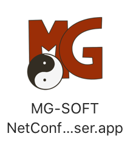

When you start the MG-SOFT NetConf Browser for the first time, it will give you the opportunity
to install the evaluation license
(you can also do this later using the Help → Apply License Key... menu item.)

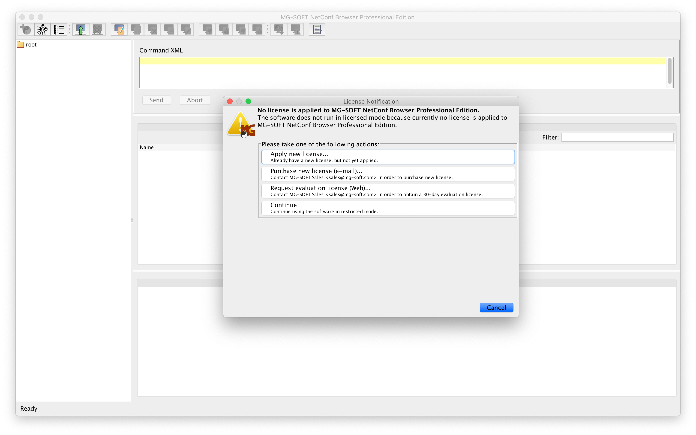

After installing the license key, you end up in the following screen:

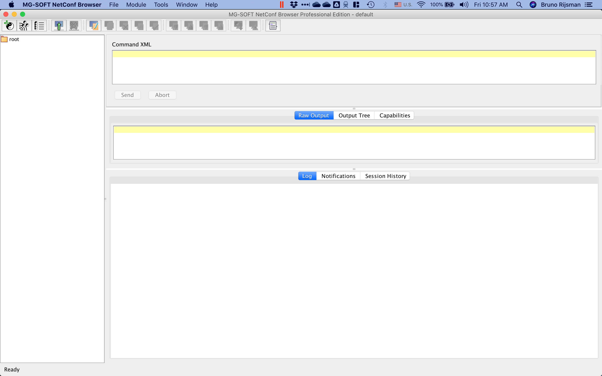

# Load the YANG data model into MG-SOFT NetConf Browser

The first thing we have to do is to load our `interfaces.yang` YANG data model into the
MG-SOFT NetConf Browser.
Select the Module → Load Module... menu item, and open the `interfaces.yang` file in this
repository.

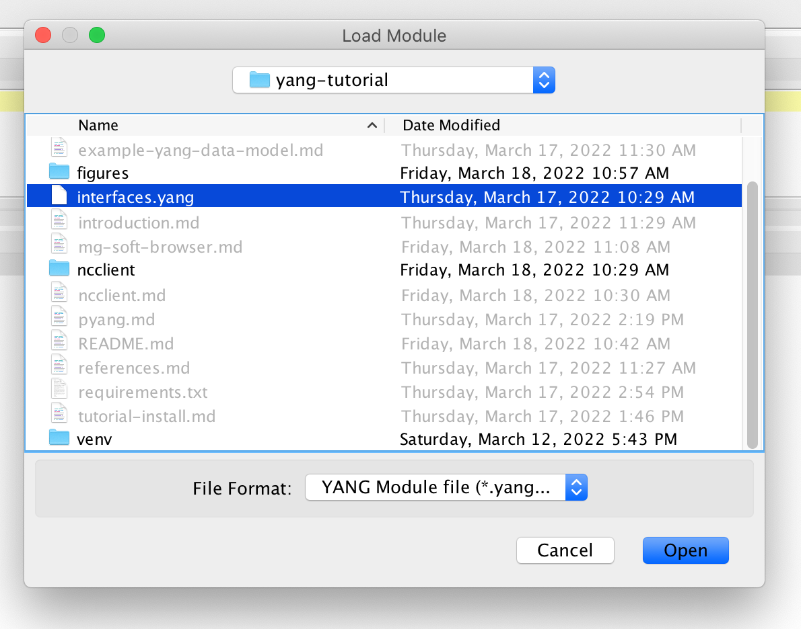

The `interfaces` YANG module appears in the left pane of the MG-SOFT NetConf Browser.

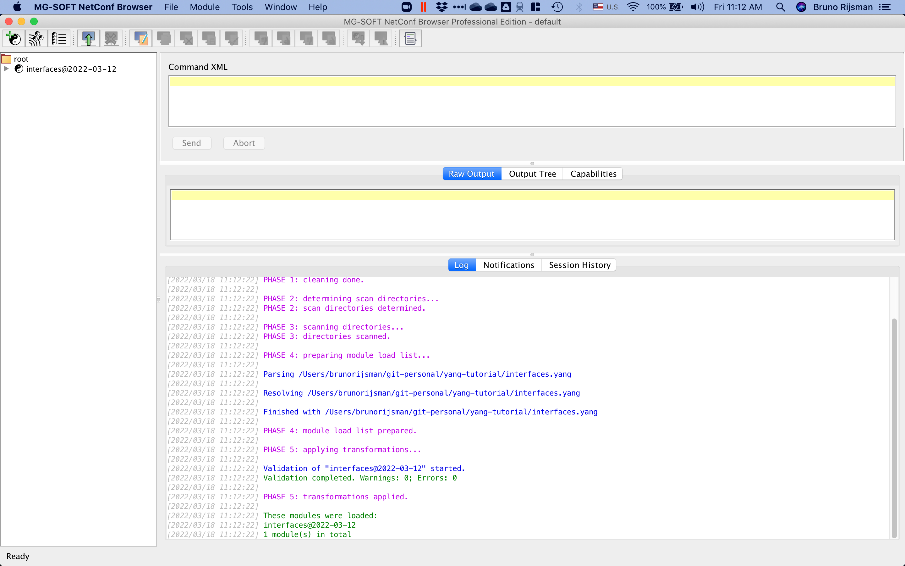

You can right-click on `interfaces` and choose menu item Expand Entire Subtree.

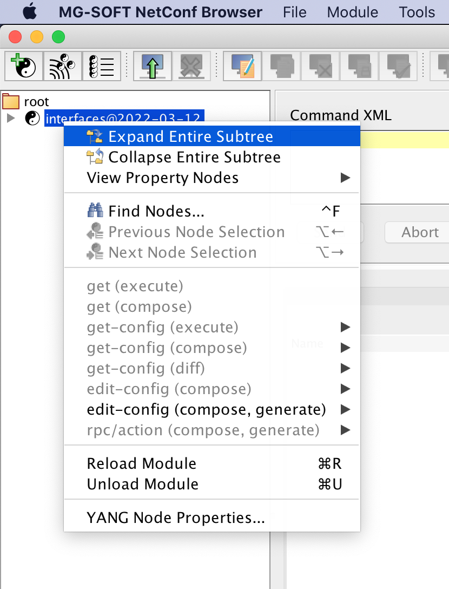

This shows an outline of the `interfaces` YANG module.

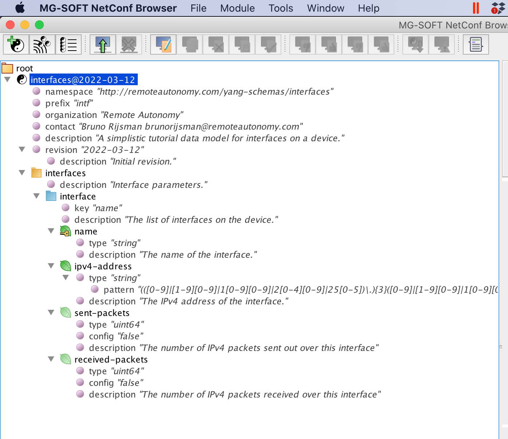

# Connect to the NETCONF server

To connect ot the clixon NETCONF server, select the File → Connect... menu item and enter the
following information (replace 10.211.55.8 with the IP address of the virtual machine that runs
your NETCONF server and replace parallels with the username on the virtual machine).

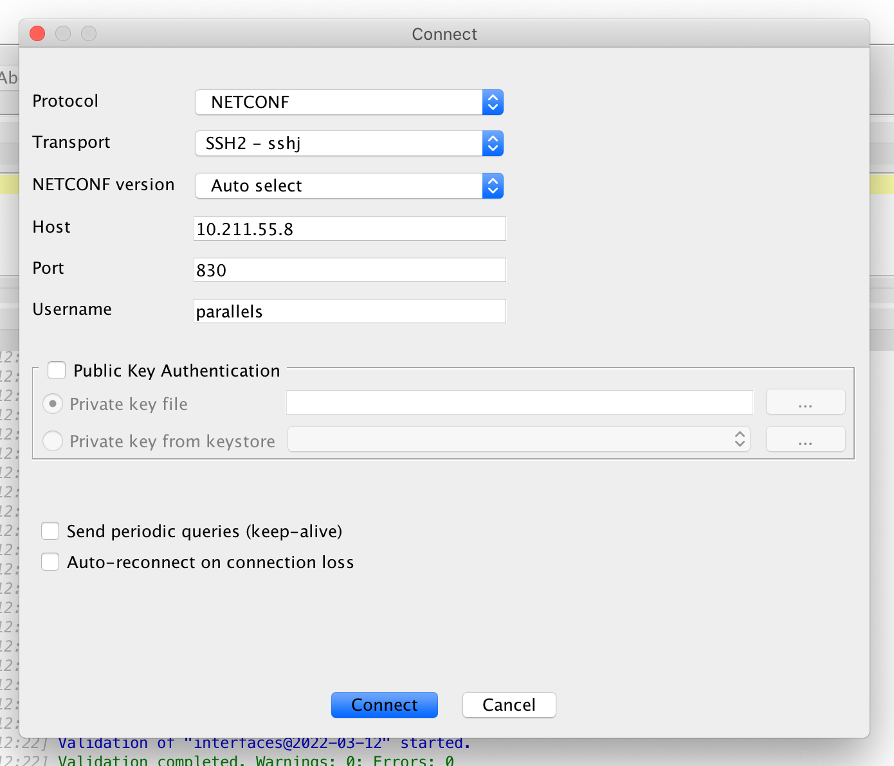

Note: until recently clixon had a bug that prevented it from interoperating with clients running
NETCONF version 1.1 (see [clixon issue #314](https://github.com/clicon/clixon/issues/314)).
The symptom is that the clixon server stops responding after the initial hello message.
By the time you are reading this tutorial, that bug should already have been fixed, but if not,
you can work around the issue by selecting NETCONF version → 1.0 in the connect screen.

If you click on the Session History tab, you can see that the session is connected.

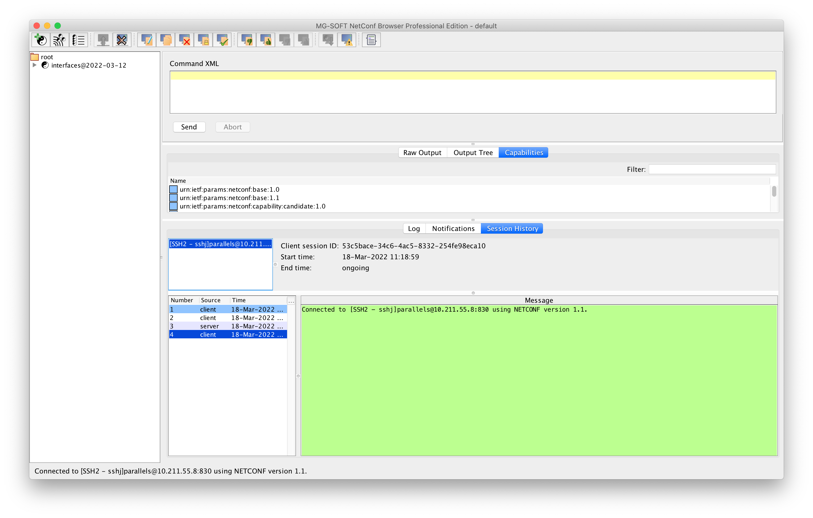

# Retrieve the configuration

To retrieve the current candidate configuration (for example), right-click on the interfaces
module, and then select get config (execute) → candidate.

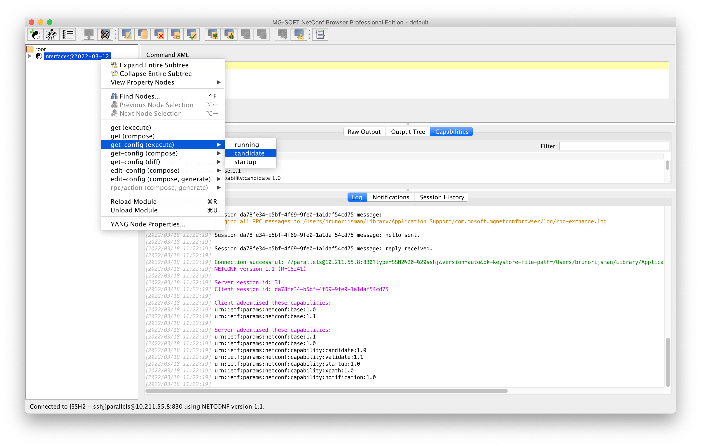

The retrieved configuration is shown in XML format in the middle pane (which you can make
bigger). Note: this screenshot assumes that two interfaces have been configured in the clixon CLI.

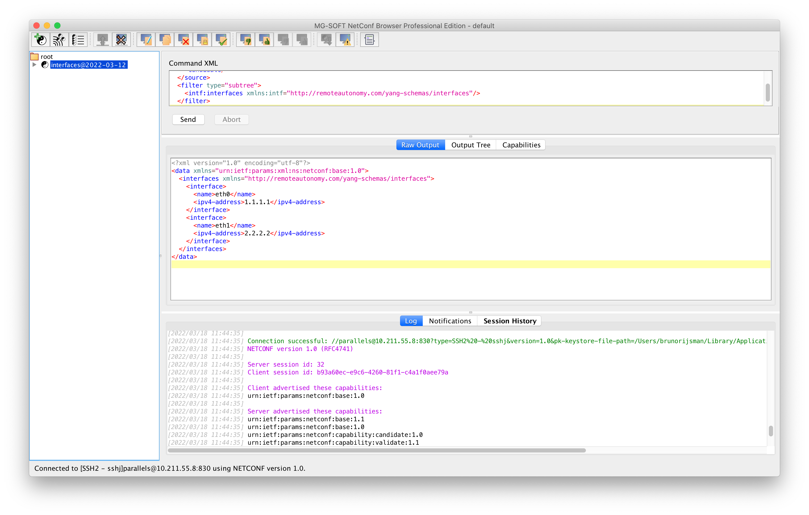

To display the same configuration in a more convenient graphical tree format, click
on the Output Tree tab:

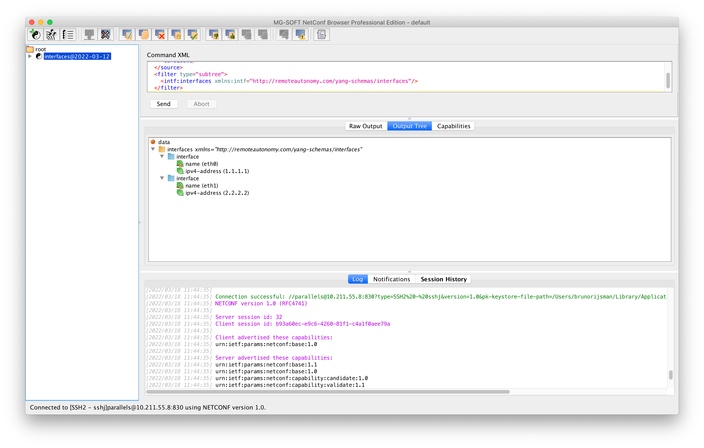

# Change the configuration

To edit the candidate configuration, right-click on the interfaces
module, and then select edit config (compose) → candidate.

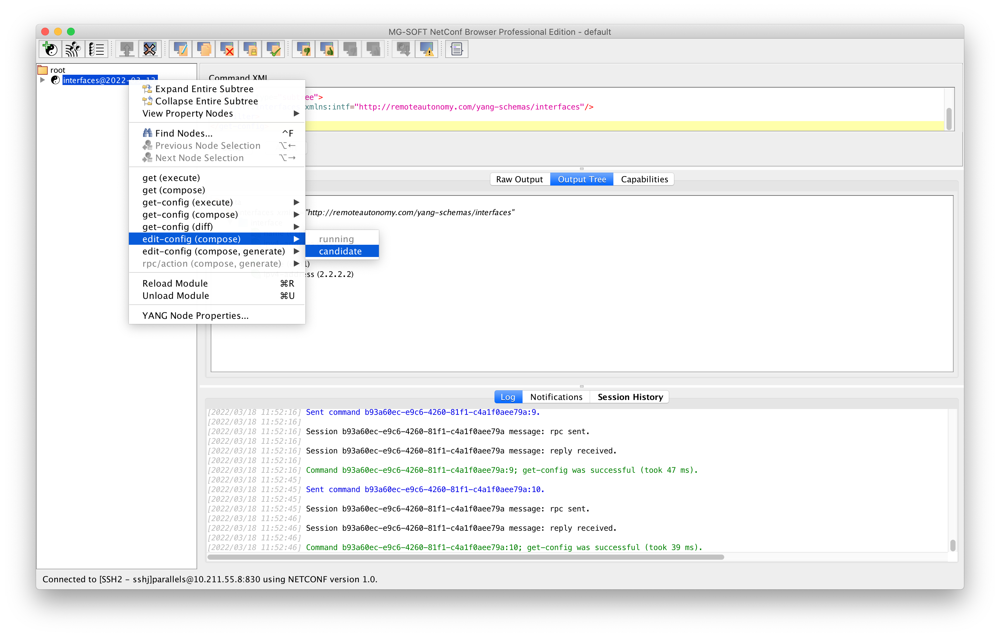

The NETCONF Content Editor window will appear, in which you can change the configuration
(here we changed the IP address for interface eth1 from 2.2.2.2 to 3.3.3.3).

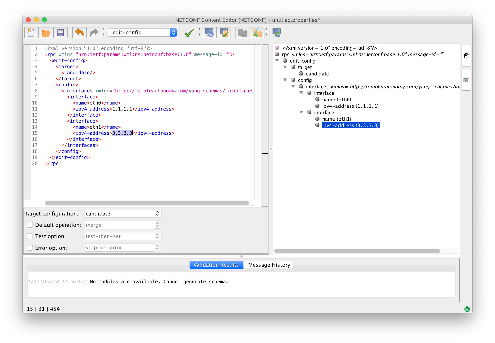

Note: the nixon NETCONF server does not accept an empty message identified, so you have to enter
some value (any value) for the `message-id`.

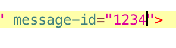

At this point you can validate the new configuration on the server by clicking on the 
Validate on Server button (yellow document with green checkmark):

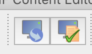

TODO: This does not work; MG-SOFT NetConf Browser reports an error:

```xml
<?xml version="1.0" encoding="utf-8"?>
<rpc-reply xmlns="urn:ietf:params:xml:ns:netconf:base:1.0" message-id="17">
  <rpc-error>
    <error-type>application</error-type>
    <error-tag>operation-failed</error-tag>
    <error-severity>error</error-severity>
    <error-message>open(/usr/local/var/interfaces/config_db)</error-message>
  </rpc-error>
</rpc-reply>
```

For some reason, clixon tries to open `/usr/local/var/interfaces/config_db` which does not exist:

<pre>
$ <b>ls -1 /usr/local/var/interfaces</b>
candidate_db
running_db
startup_db
tmp_db
</pre>

## References

* [The MG-SOFT company homepage](https://www.mg-soft.si/)

* [The MG-SOFT NetConf Browser Professional Edition product page](https://www.mg-soft.si/mgNetConfBrowser.html)
