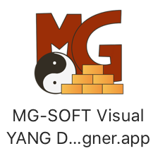

# MG-SOFT Visual YANG Designer Professional Edition

## Introduction

[MG-SOFT](https://www.mg-soft.si/) is a company that offers a suite of network management related
products.
One of their products, the
[MG-SOFT Visual YANG Designer Professional Edition](https://www.mg-soft.si/mgYangDesigner.html)
is a YANG authoring tool that allows you to edit YANG data models in an integrated development
environment (IDE).

## Download and install

You can download the MG-SOFT Visual YANG Designer Professional Edition from the 
[download page](https://www.mg-soft.si/download.html?product=yangdesigner&os=java)
on the MG-SOFT website.
The designer is available for Windows, macOS, and several flavors of Linux.
In this tutorial I use the macOS version.

To do anything interesting with the MG-SOFT Visual YANG Designer, you will need to apply a license key.
You can [purchase a license online](https://www.mg-soft.si/mgYangDesigner-ordering.html)
or you can [request a 30-day evaluation license online](https://www.mg-soft.si/evalKeyReq.html).
The evaluation license does not allow you to save YANG files.
Note: I am not affiliated with MG-SOFT in any way and I don't get any commission.

## Start

Double click on the MG-SOFT Visual YANG Designer icon in the applications folder.

When you start the MG-SOFT Visual YANG Designer for the first time, it will give you the opportunity
to install the evaluation license
(you can also do this later using the Help → Apply License Key... menu item.)

## Create a new project

After MG-SOFT Visual YANG Designer has been started, choose the Create a new project option:

and enter the details for the newly created project:

## Create a new module

Click on the new module button:

and enter the details for the newly created module:

The newly created empty module is displayed:

## Add components to the module

In the left Project panel click on the <button>Components</button> tab:

Drag and drop components from the left Project panel to the middle YANG Tree Preview panel. 
As you are dropping the component into the middle YANG Tree Preview panel,
you will see gray lines to indicate where the component is allowed to be dropped.
After a component has been dropped in place, you can enter details for component in the top
right Node Editor panel (in the screenshot below we are entering details for a newly added `burners`
container).
In the bottom right Source panel you can see and edit the source code for the YANG data model as
it is being constructed.

## View the module source

Click on the <button>Source</button> to see and edit the source code of the YANG data model in a
larger Source panel in the top right:

## View errors

If there are any errors in your YANG data models, you can see them in the
<button>Validation Messages</button> tab in the bottom-right panel, and the offending lines
are marked with a red exclamation mark in the source code:

## References

* [The MG-SOFT company homepage](https://www.mg-soft.si/)

* [The MG-SOFT Visual YANG Designer Professional Edition product page](https://www.mg-soft.si/mgYangDesigner.html)
