# MG-SOFT YANG Explorer Professional Edition

## Introduction

[MG-SOFT](https://www.mg-soft.si/) is a company that offers a suite of network management related
products.
One of their products, the
[MG-SOFT YANG Explorer Professional Edition](https://www.mg-soft.si/mgYangExplorer.html)
allows you to explore, validate, and convert YANG data models.

## Download and install MG-SOFT NetConf Browser Professional Edition

You can download the MG-SOFT YANG Explorer Professional Edition from the 
[download page](https://www.mg-soft.si/download.html?product=yangexplorer&os=java)
on the MG-SOFT website.
The explorer is available for Windows, macOS, and several flavors of Linux.
In this tutorial I use the macOS version.

To do anything interesting with the MG-SOFT YANG Explorer, you will need to apply a license key.
You can [purchase a license online](https://www.mg-soft.si/mgYangExplorer-ordering.html)
or you can [request a 30-day evaluation license online](https://www.mg-soft.si/evalKeyReq.html).
Note: I am not affiliated with MG-SOFT in any way and I don't get any commission.

# Start the MG-SOFT YANG Explorer

Double click on the MG-SOFT YANG Explorer icon in the applications folder.

When you start the MG-SOFT YANG Explorer for the first time, it will give you the opportunity
to install the evaluation license
(you can also do this later using the Help → Apply License Key... menu item.)

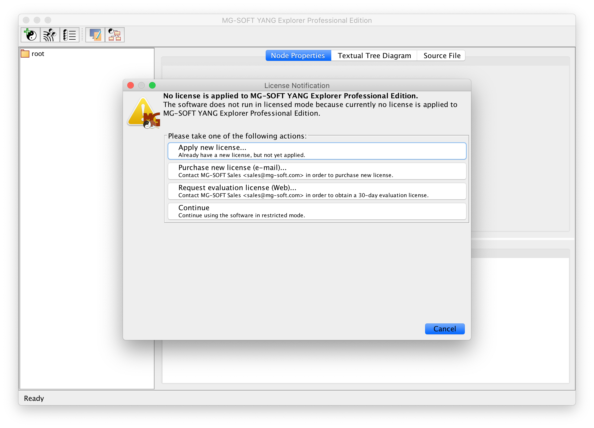

After installing the license key, you end up in the following screen.
On the left side you see a list of standard IETF YANG data models that come bundled with the
MG-SOFT YANG Explorer.

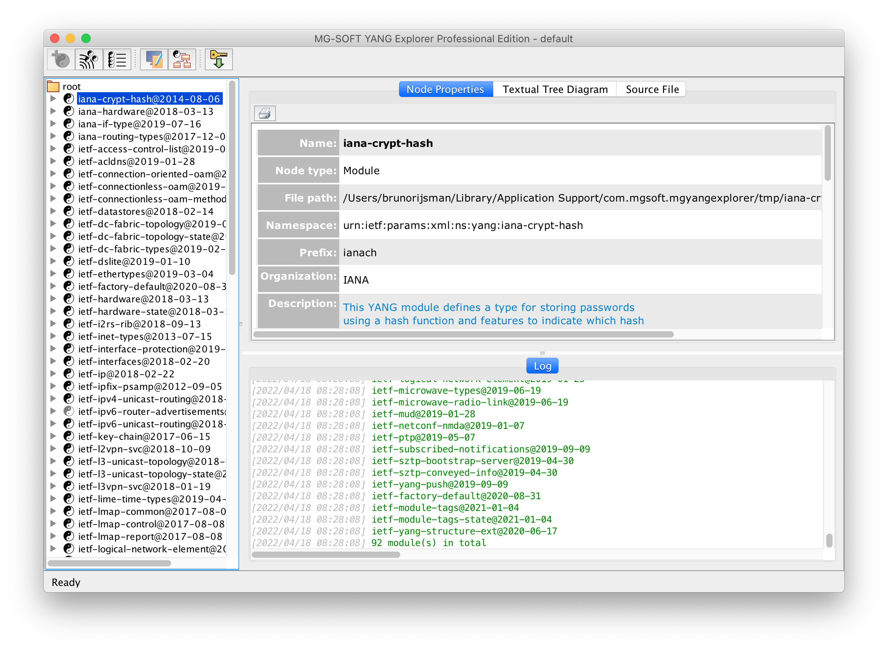

# Load a YANG data model

The first thing we have to do is to load our `interfaces.yang` YANG data model into the
MG-SOFT YANG Explorer.
Select the Module → Load Module... menu item, and open the `interfaces.yang` file in this
repository.

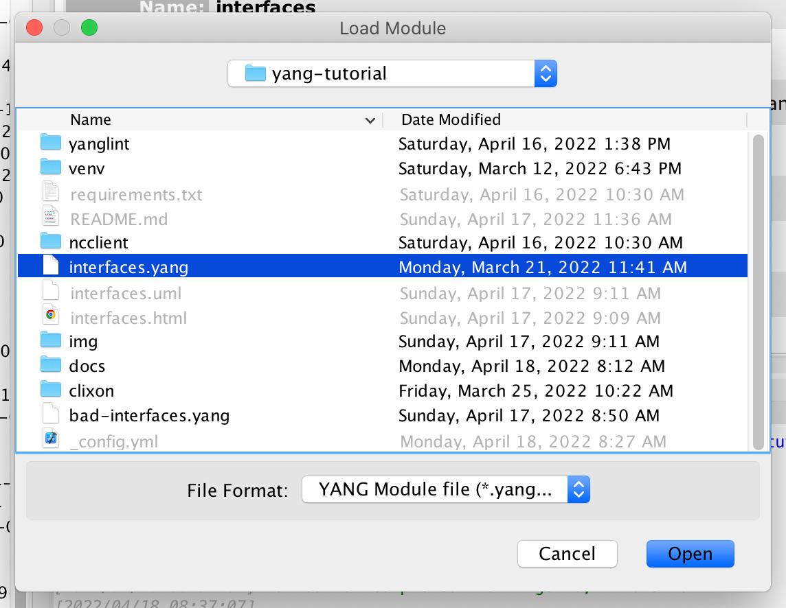

# Explore a YANG data model

The `interfaces` YANG module appears in the left pane; when you click on it, you get the details.

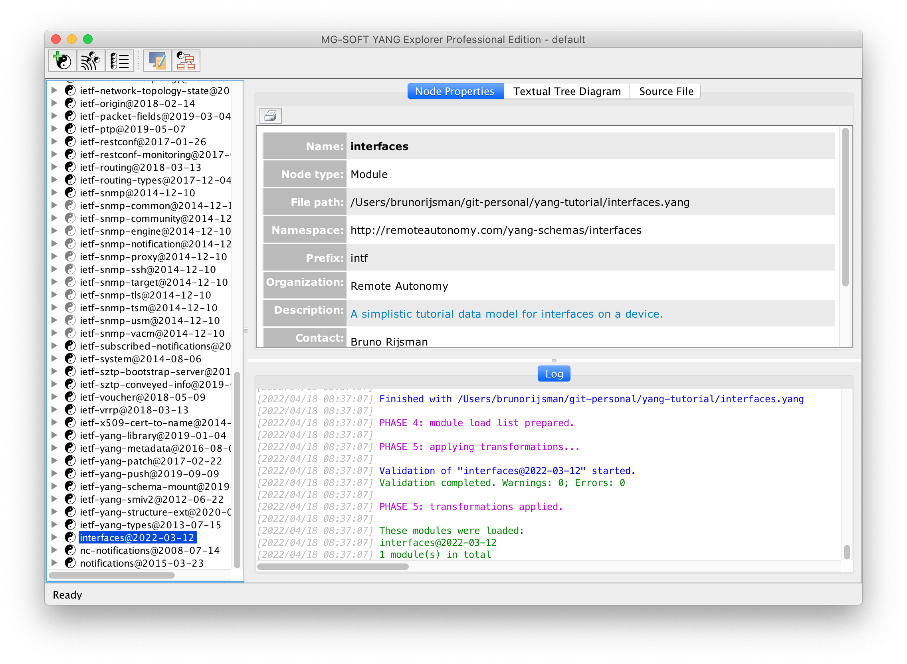

You can click on the triangle next to the `interfaces` YANG module to expand it one level,
or you can right-click on the module and select Expand Entire Subtree:

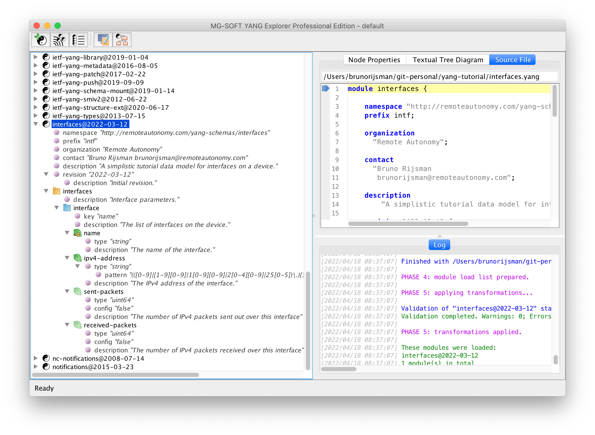

While in the tree pane, you can use menu item Edit → Find Nodes... (⌘F) to search for specific nodes.
In the following screenshot we search for all leaf nodes that contain the word address:

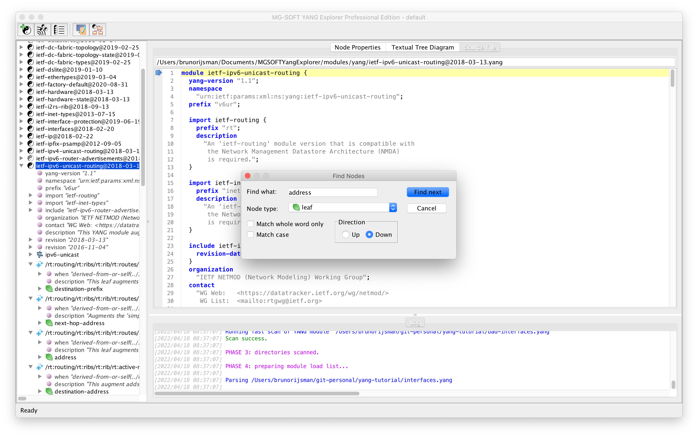

Clicking the <button>Textual Tree Diagram</button> tab displays the textual tree diagram:

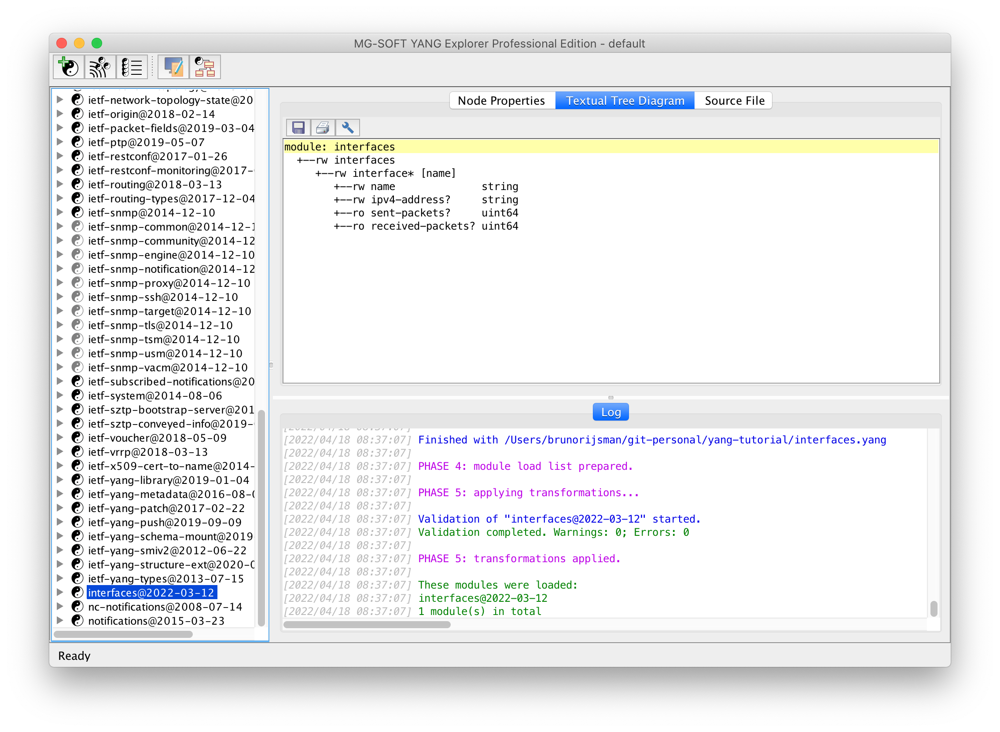

Clicking the <button>Source File</button> tab displays the source code for the YANG data model:

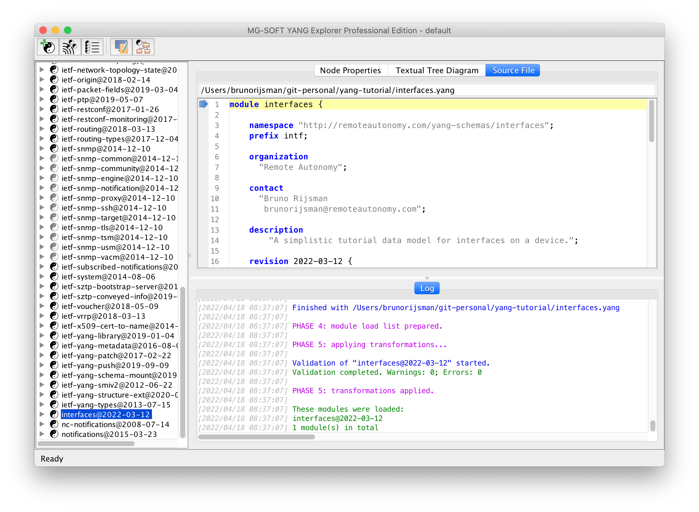

Our `interfaces` example YANG module is very simple and doesn't import any other modules,
but most real-life modules do.
The following screenshot shows the standard IETF YANG module `ietf-ipv6-unicast-routing`.
On line 15 it imports another YANG module `ietf-inet-types`.
You can right-click on the `import` statement and select Show in YANG Tree to navigate to the
imported module

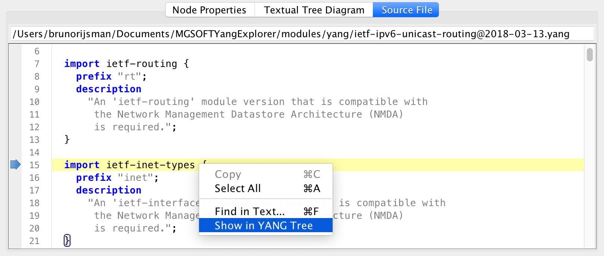

## View UML diagram

Select menu item View → UML Class Diagram... and click on the 🔧 icon to select a YANG data model
and displays its UML class diagram:

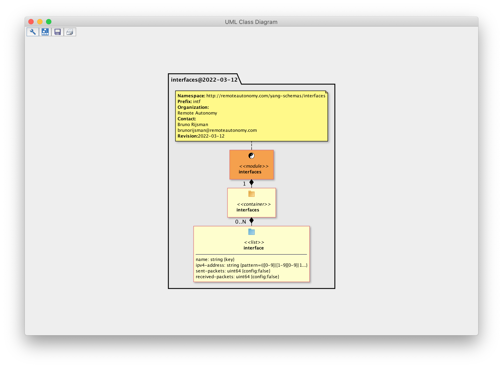

## View dependencies

Select menu item View → YANG Dependencies... and click on the 🔧 icon to select a YANG data model
and displays its YANG dependencies:

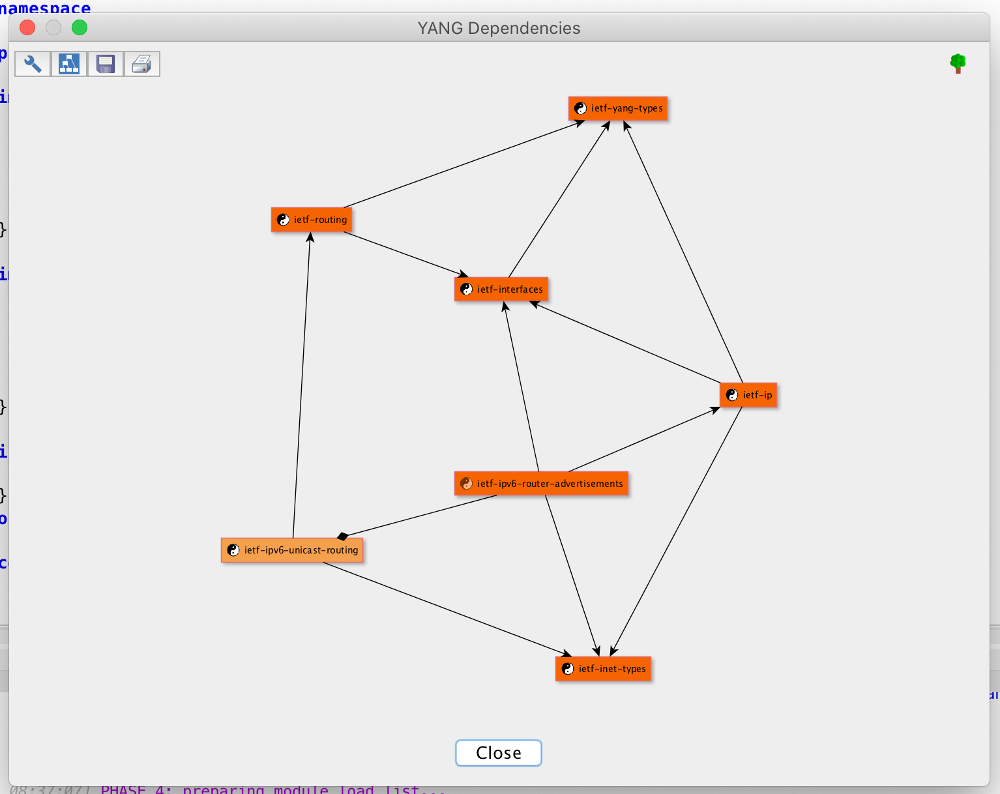

## References

* [The MG-SOFT company homepage](https://www.mg-soft.si/)

* [The MG-SOFT YANG Explorer Professional Edition product page](https://www.mg-soft.si/mgYangExplorer.html)
