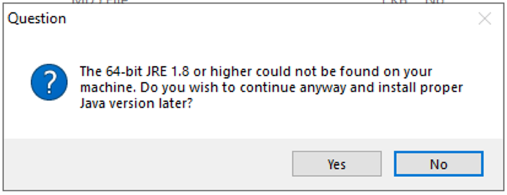

# MG-SOFT NETCONF Simulator

## Introduction

[MG-SOFT](https://www.mg-soft.si/) is a company that offers a suite of network management related
products.
One of their products, the
[MG-SOFT NETCONF Simulator](https://www.mg-soft.si/mgNetConfSimulator.html)
allows you to simulate network devices that act as NETCONF or RESTCONF servers.

## Download and install (attempt)

You can download the MG-SOFT NETCONF Simulator Edition from the 
[download page](https://www.mg-soft.si/download.html?product=netconfsimulator)
on the MG-SOFT website.
The simulator is only available on Microsoft Windows.

Unfortunately, I don't own any Windows computers.
I tried using Microsoft Windows Server 2019 Base running in a t2.large instance on Amazon Web
Services (AWS), but when I ran the MG-SOFT NETCONF Simulator installer, I got the following
error message about needing a Java Run-time Environment (JRE):

Downloading and installing "Java for Windows" from
the [Oracle website](https://www.java.com/en/download/) did not solve the problem.
I spent a half hour Googling how to download "64-bit JRE 1.8" but could not figure it out and
eventually gave up.

