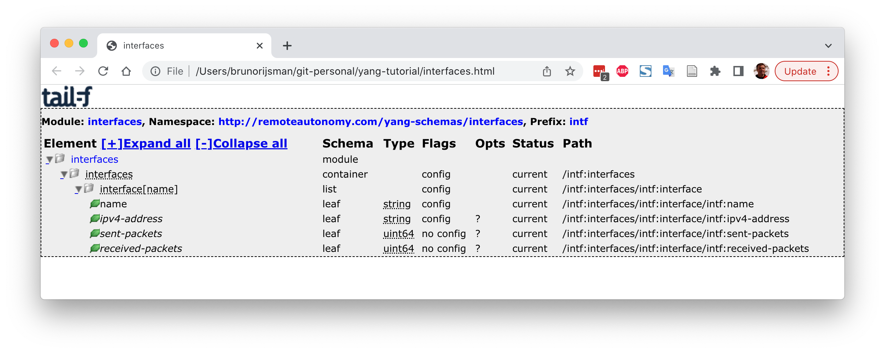
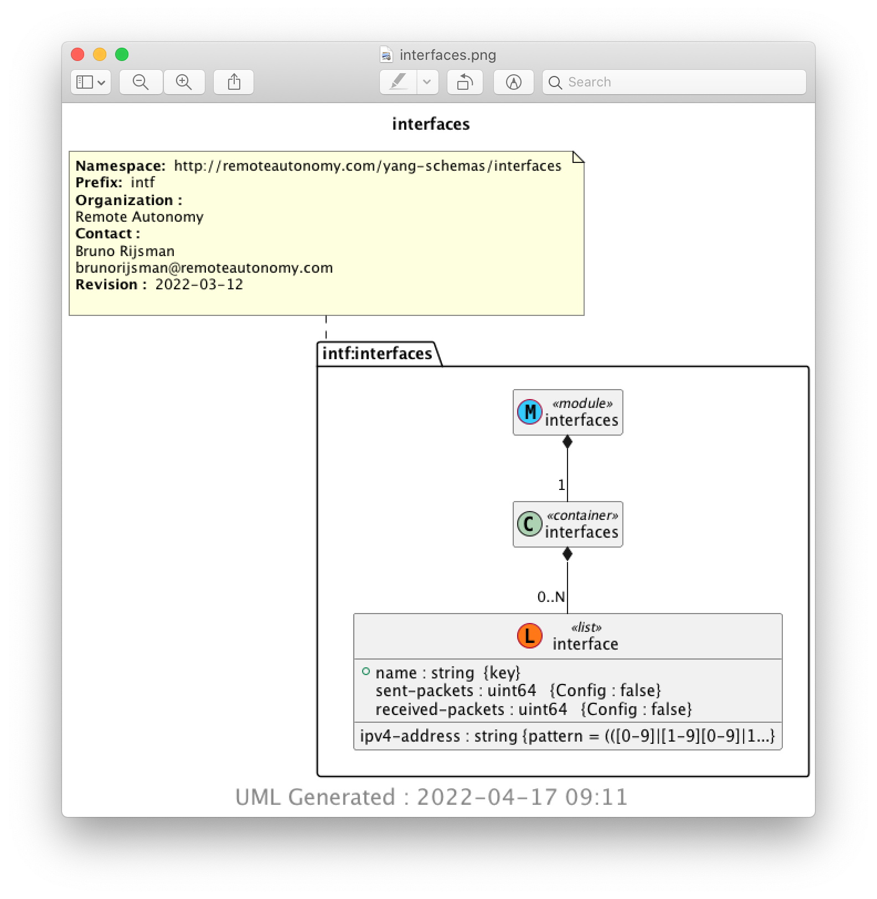

# Pyang: validating and converting YANG data models

## Introduction

[Pyang](https://github.com/mbj4668/pyang) is an open source YANG validator, transformer, and
code generator, written in Python.

## Install Pyang

If you haven't already done so, follow the instructions for
[cloning and setting up this repository](#cloning-and-setting-up-this-repository)
and the instructions for
[setting up a python virtual environment](#setting-up-a-python-virtual-environment).

If you already did these installation steps previously, don't forget to reactivate your Python
virtual environment if it isn't already active:

<pre>
$ <b>cd ~/yang-tutorial</b>
$ <b>source venv/bin/activate</b>
(env) $
</pre>

If you followed the above installation instructions, the `pyang` Python package was already
installed as part of installing the Python dependencies.

If for some reason you want to install `pyang` separately, use the following command:

<pre>
$ <b>pip install pyang</b>
</pre>

Verify that `pyang` is properly installed:

<pre>
$ <b>pyang --version</b>
pyang 2.5.2
</pre>

One of the examples in the tutorial converts the YANG data model into a UML diagram.
This requires [PlantUML](https://plantuml.com/) to be installed:

<pre>
$ <b>sudo apt install -y plantuml</b>
[...]
</pre>

## Pyang: Validating a YANG data model

The simplest way of using pyang is to validate the correctness of a YANG data model:

<pre>
$ <b>pyang interfaces.yang</b>
</pre>

The fact that we get no output means that the YANG file was correct. In addition, the program
returns status code zero, so you can do something like this:

<pre>
$ <b>if pyang interfaces.yang; then echo "All good"; else "There are errors"; fi</b>
All good
</pre>

Just to see what happens if there is an error, edit the YANG file and change the word
`organization` to its British spelling `organisation`
(don't forget to change it back afterwards):

<pre>
$ <b>pyang interfaces.yang</b>
interfaces.yang:7: error: unexpected keyword "organisation"
</pre>

## Pyang: Converting a YANG data model

YANG data models tend to be very long and verbose. Pyang can produce a summary of the YANG data
model in a tree format:

<pre>
$ <b>pyang -f tree interfaces.yang</b>
module: interfaces
  +--rw interfaces
     +--rw interface* [name]
        +--rw name                string
        +--rw ipv4-address?       string
        +--ro sent-packets?       uint64
        +--ro received-packets?   uint64
</pre>

The command `pyang --tree-help` displays an explanation of the symbols in the tree diagram.

In addition to producing a tree summary, Pyang can also convert the YANG data model to many other
formats:

<pre>
$ <b>pyang --help</b>
Usage: pyang [options] [<filename>...]

Validates the YANG module in <filename> (or stdin), and all its dependencies.

Options:
  -h, --help            Show this help message and exit
[...]
  -f FORMAT, --format=FORMAT
                        Convert to FORMAT.  Supported formats are: yang, yin,
                        dsdl, omni, tree, jstree, flatten, uml, identifiers,
                        sample-xml-skeleton, capability, jsonxsl, depend,
                        jtox, name
[...]
</pre>

We will give just a couple of examples of interesting format conversions.

Use the following command to produce an HTML file that describes the YANG data model
(`jstree` stands for JavaScript tree):

<pre>
$ <b>pyang -f jstree interfaces.yang > interfaces.html</b>
</pre>

Use any web browser to view the produced HTML file. Here we assume that you are running Ubuntu and
that you can start `firefox` from command line (on macOS use `open interfaces.html`):

<pre>
$ <b>firefox interfaces.html</b>
</pre>

Another interesting option is to convert the YANG data model into a UML diagram:

<pre>
$ <b>pyang -f uml interfaces.yang > interfaces.uml</b>
</pre>

You need to have `plantuml` installed (see
[pyang installation instructions](#pyang-installation-instructions)
) to convert the produced UML text file to a graphical PNG file:

<pre>
$ <b>plantuml interfaces.uml</b>
</pre>

The PNG file can be viewed in a web browser:

<pre>
$ <b>firefox img/interfaces.png</b>
</pre>

## References

* [The pyang GitHub repository](https://github.com/mbj4668/pyang)

* [A pyang tutorial](https://www.ietf.org/slides/slides-edu-pyang-tutorial-01.pdf)

* [The PlantUML home page](https://plantuml.com/)

