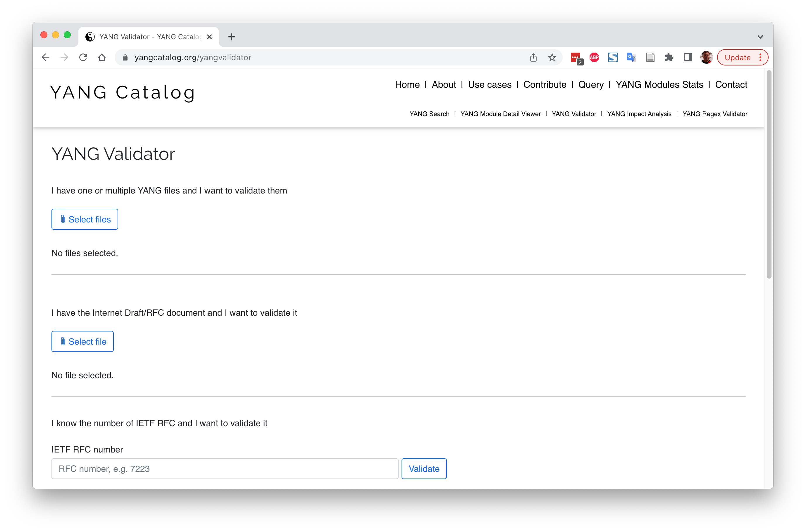
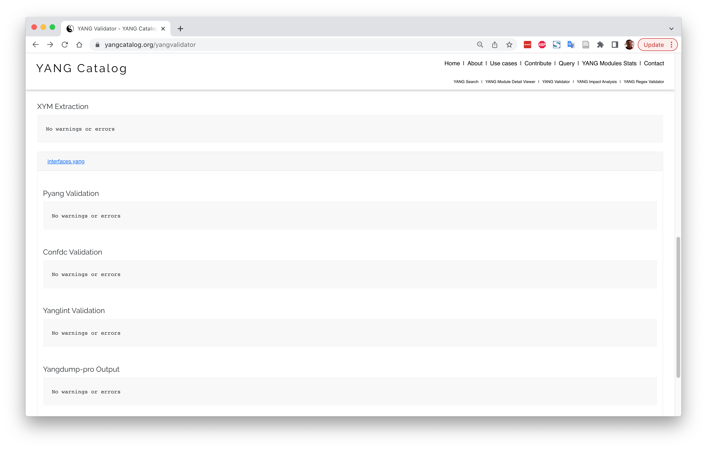
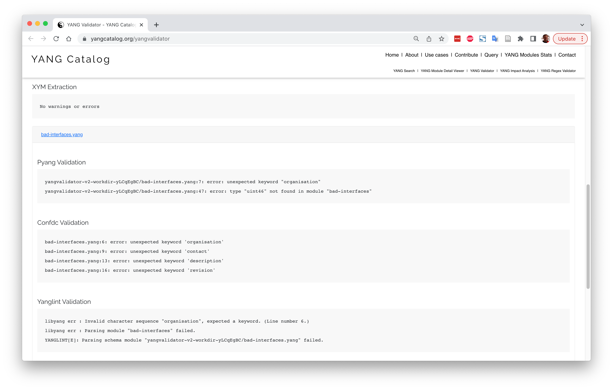

# YANG validator

## Introduction

[YANG validator](https://yangcatalog.org/yangvalidator) is a web-based YANG data model validator.
It is part of the [YANG catalog](https://yangcatalog.org/home.html) website.

The home page of the YANG validator looks like this:

## Validate a correct YANG data model

To validate the `interfaces.yang` data model, click the
<button>Select files</button>
button in the 
"I have one or multiple YANG files and I want to validate them"
section, select file `interfaces.yang` and then click the
<button>Validate</button>
button.

The validation results page reports the following results:

* Extraction results from [XYM](https://github.com/xym-tool/xym) which is a tool to extract YANG data models
  from a file (e.g. an IETF ID or RFC).

* Validation results from the pyang YANG validator.
  See the [pyang page in this tutorial](tutorial/payng.md) for more details on pyang.

* Validation results from the Cisco Tail-f ConfD YANG compiler.
  See the [CONFD page in this tutorial](tutorial/confd.md) (TODO) for more details on ConfD.

* Validation results from the yanglint YANG validator.
  See the [yanglint page in this tutorial](tutorial/yanglint.md) for more details on yanglint.

* Validation results from the YumaWorks yangdump-pro YANG validator.
  See the [yangdump-pro page in this tutorial](tutorial/yangdump-pro.md) (TODO) for more details on yangdump-pro.

## Validate an incorrect YANG data model

The following screenshot shows an example of validating an incorrect YANG data model,
namely `bad-interfaces.yang`.

## Validate an IETF internet draft (ID) or request for comment (RFC)

YANG validator can also validate an IETF internet draft (ID) or request for comment (RFC)
that contains YANG data models (as described in section 3.2 of 
[RFC 8407](https://datatracker.ietf.org/doc/rfc8407/)).

For example, enter [8348](https://datatracker.ietf.org/doc/rfc8348/)
in the field in the
"I know the number of IETF RFC and I want to validate it"
section, then click the
<button>Validate</button>
button, and accept the default values in the "Additional Information Required" window

## References

* [YANG Validator home page](https://yangcatalog.org/yangvalidator)

* [XYM YANG data model extraction tool](https://github.com/xym-tool/xym)
