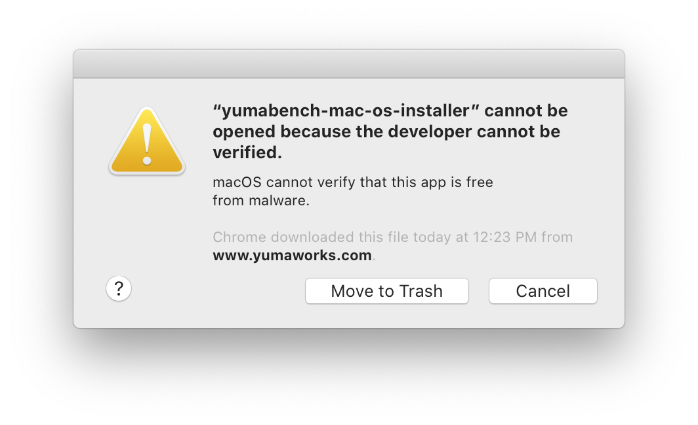
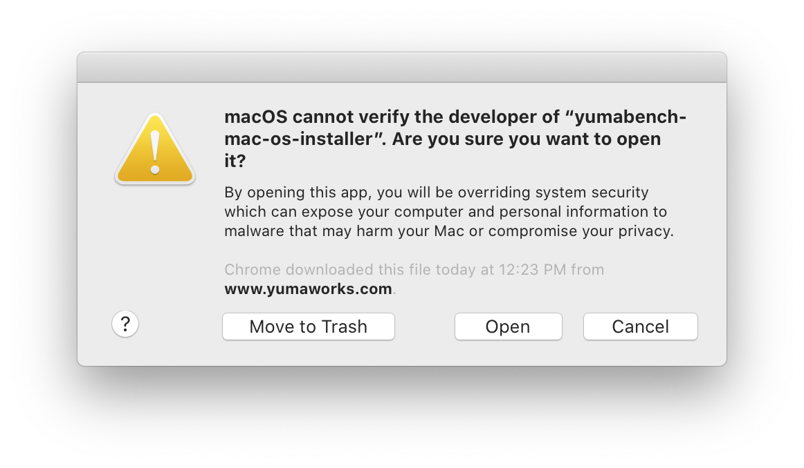
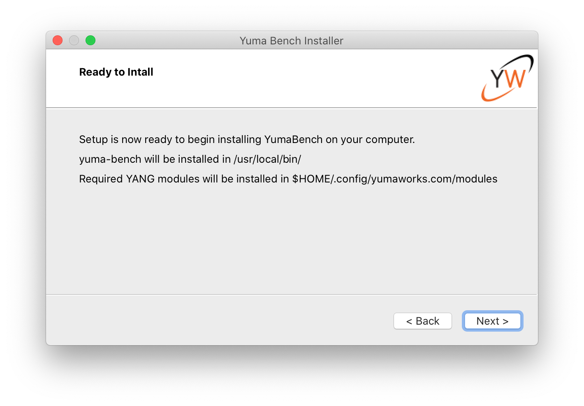

# YumaPro yangdump-pro from YumaWorks

## Introduction

[YumaWorks](https://www.yumaworks.com/) is a company that offers a suite of network management
and control plane automation tools, with a focus on YANG, NETCONF, and RESTCONF.

Their product [YumaPro Client](https://www.yumaworks.com/download/yumapro-client-21-10-5-zip/)
consists of three tools:

1. yangcli-pro: [TODO] Summary

2. yangdump-pro: [TODO] Summary

3. yangdiff-pro: [TODO] Summary

4. yumabench: [TODO] Summary

The YumaPro Client software is free. 
The license allows you to use it
"for internal use only, for the sole purpose of defining and managing networking devices
on its own internal (enterprise) network."
Note: I am not affiliated with YumaWorks in any way and I don't get any commission.

## Download and install


You can download the YumaPro Client software from the
[download page](https://www.yumaworks.com/support/download-yumapro-client/)
It is available for macOS and for several Linux distributions.
I evaluated version 21.10-5 for macOS.

The installation procedure downloads a zip file with the following contents:

```
.
├── etc
│   └── yumapro
│       ├── yangcli-pro-sample.conf
│       ├── yangdiff-pro-sample.conf
│       └── yangdump-pro-sample.conf
└── usr
    └── local
        ├── bin
        │   ├── yangcli-pro
        │   ├── yangdiff-pro
        │   ├── yangdump-pro
        │   └── yumabench-mac-os-installer
        ├── lib
        │   ├── libyumapro_mgr.dylib
        │   ├── libyumapro_ncx.dylib
        │   └── libyumapro_ycli.dylib
        └── share
            ├── doc
            │   └── yumapro
            │       ├── AUTHORS
            │       ├── README.yumapro-client
            │       ├── yumapro-client-user-license.pdf
            │       └── yumapro-legal-notices.pdf
            ├── man
            │   └── man1
            │       ├── yangcli-pro.1.gz
            │       ├── yangdiff-pro.1.gz
            │       ├── yangdump-pro.1.gz
            │       └── yumabench-mac-os-installer.1.gz
            └── yumapro
                └── modules
                    ├── ietf
                    │   └── RFC
                    │       ├── iana-crypt-hash.yang
                    │       ├── iana-hardware.yang
                   ...     ...
                    │       └── notifications.yang
                    ├── mib
                    │   ├── IANAifType-MIB.yang
                    │   ├── IF-MIB.yang
                   ...     ...
                    │   └── yang-smi.yang
                    ├── netconfcentral
                    │   ├── toaster.yang
                    │   ├── yuma-app-common.yang
                   ...     ...
                    │   └── yuma-xsd.yang
                    └── yumaworks
                        ├── example-fan.yang
                        ├── netconfd-pro.yang
                       ...     ...
                        └── yumaworks-yp-ha.yang
```

Run the `yumabench-mac-os-installer` in the extracted `usr/local/bin` directory.
Initially, you will get the following error popup:



To fix this error, you need to open the System Preferences app,
go into the Security & Privacy tab, and click the Allow Anyway button next to the warning
"yumabench-mac-os-installer" was blocked from use because it is not from an identified developer.
When you run the installer again, click op Open when you get the following warning:



The installer reports that it installs files into the following directories:



## References

* [The YumaWorks company homepage](https://www.yumaworks.com/)

* [The YumaPro Client product page](https://www.yumaworks.com/download/yumapro-client-21-10-5-zip/)

* [YumaPro yangdump-pro and yangdump-sdk manual](https://www.yumaworks.com/pub/docs/latest/html/yangdump/yumapro-yangdump-manual.xhtml)
