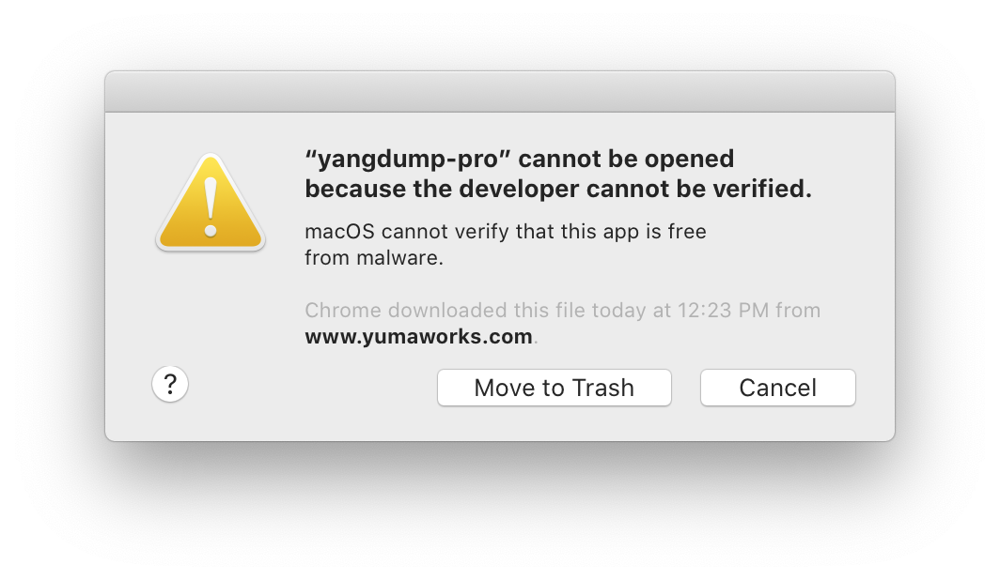
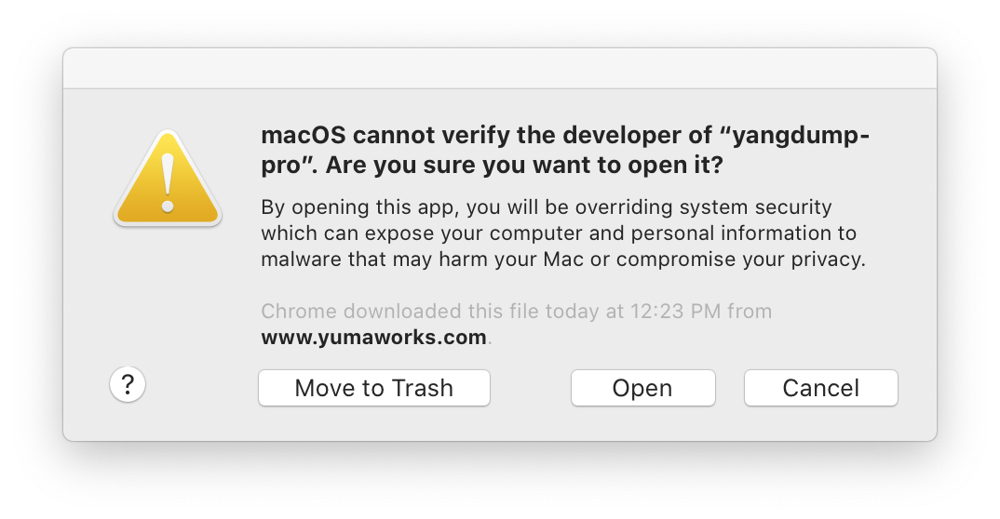
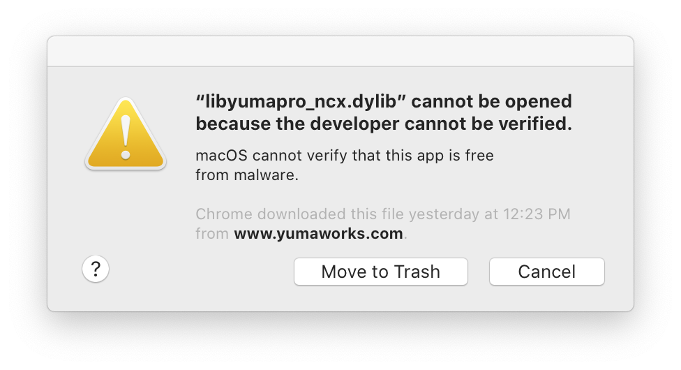
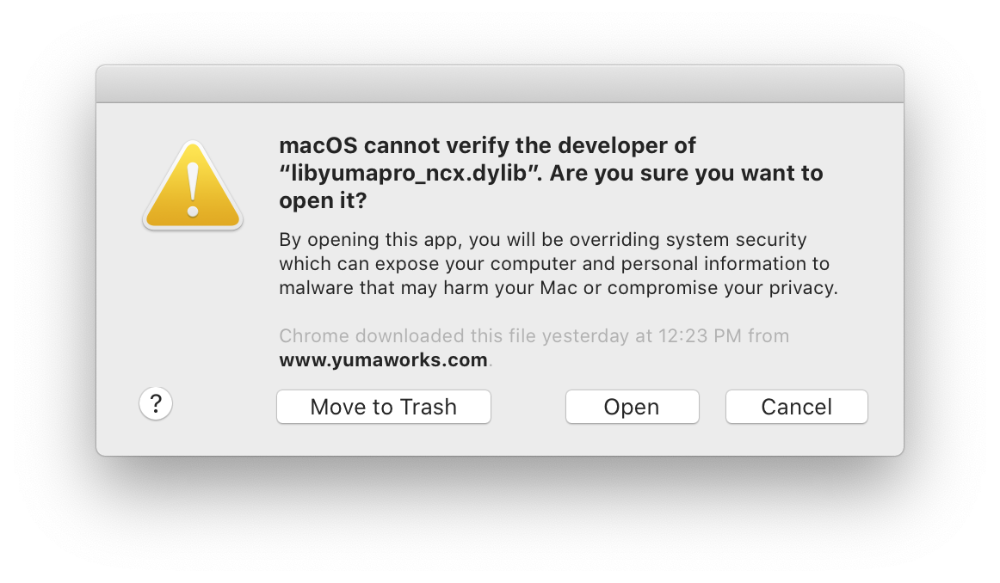
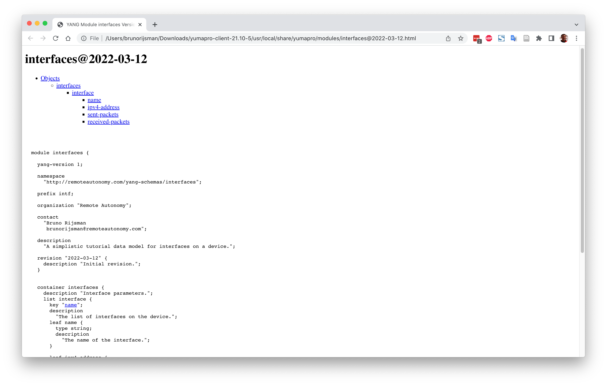

# YumaPro yangdump-pro from YumaWorks

## Introduction

[YumaWorks](https://www.yumaworks.com/) is a company that offers a suite of network management
and control plane automation tools, with a focus on YANG, NETCONF, and RESTCONF.

Their product [YumaPro Client](https://www.yumaworks.com/download/yumapro-client-21-10-5-zip/)
consists of three tools:

1. yangdump-pro: [TODO] Summary

2. yangdiff-pro: [TODO] Summary

3. yangcli-pro: [TODO] Summary


YumaPro Client also includes an installer for YumaBench, but we discuss YumaBench separately
[here](yumabench.md).

The YumaPro Client software is free. 
The license allows you to use it
"for internal use only, for the sole purpose of defining and managing networking devices
on its own internal (enterprise) network."
Note: I am not affiliated with YumaWorks in any way and I don't get any commission.

## Download and install


You can download the YumaPro Client software from the
[download page](https://www.yumaworks.com/support/download-yumapro-client/)
It is available for macOS and for several Linux distributions.
I evaluated version 21.10-5 for macOS.

The installation procedure downloads a zip file with the following contents:

```
.
├── etc
│   └── yumapro
│       ├── yangcli-pro-sample.conf
│       ├── yangdiff-pro-sample.conf
│       └── yangdump-pro-sample.conf
└── usr
    └── local
        ├── bin
        │   ├── yangcli-pro
        │   ├── yangdiff-pro
        │   ├── yangdump-pro
        │   └── yumabench-mac-os-installer
        ├── lib
        │   ├── libyumapro_mgr.dylib
        │   ├── libyumapro_ncx.dylib
        │   └── libyumapro_ycli.dylib
        └── share
            ├── doc
            │   └── yumapro
            │       ├── AUTHORS
            │       ├── README.yumapro-client
            │       ├── yumapro-client-user-license.pdf
            │       └── yumapro-legal-notices.pdf
            ├── man
            │   └── man1
            │       ├── yangcli-pro.1.gz
            │       ├── yangdiff-pro.1.gz
            │       ├── yangdump-pro.1.gz
            │       └── yumabench-mac-os-installer.1.gz
            └── yumapro
                └── modules
                    ├── ietf
                    │   └── RFC
                    │       ├── iana-crypt-hash.yang
                    │       ├── iana-hardware.yang
                   ...     ...
                    │       └── notifications.yang
                    ├── mib
                    │   ├── IANAifType-MIB.yang
                    │   ├── IF-MIB.yang
                   ...     ...
                    │   └── yang-smi.yang
                    ├── netconfcentral
                    │   ├── toaster.yang
                    │   ├── yuma-app-common.yang
                   ...     ...
                    │   └── yuma-xsd.yang
                    └── yumaworks
                        ├── example-fan.yang
                        ├── netconfd-pro.yang
                       ...     ...
                        └── yumaworks-yp-ha.yang
```

## Getting the executables to run

The directory `usr/local/bin` in the downloaded zip file contains the executables
`yangcli-pro`, `yangdiff-pro`, and `yangdump-pro`.
When you try to run any of these executables for the first time, you get an error
similar to the following:



When that happens, click on cancel.
Then open the System Preferences app,
go into the Security & Privacy tab, and click the Allow Anyway button next to the warning
"yangdump-pro" was blocked from use because it is not from an identified developer.
When you run the executable again, click op Open when you get the following warning:



When you click on Open, you get an error similar to the following:

<pre>
$ <b>./yangdump-pro</B>
dyld: Library not loaded: libyumapro_ncx.dylib
  Referenced from: /Users/brunorijsman/Downloads/yumapro-client-21.10-5/usr/local/bin/./yangdump-pro
  Reason: image not found
[1]    31095 abort      ./yangdump-pro
</pre>

The next attempt to run the tool complains that the shared library cannot be verified:



As before, go into System Preferences at click Allow Anyway.

The next attempt to run the tool complains that it developer of the shared library cannot be
verified:



Once again, click Open.

Now you get the following error message:

<pre>
 $ <b>./yangdump-pro</b>

Load module 'yuma-ncx' failed (module not found)
yangdump-sdk: Error exit (module not found)
</pre>

To work around this error, 
(1) add `usr/local/bin` to the PATH,
(2) run the tool from the `usr/local/share/yumapro/modules` directory,
(3) use the `--modpath=.` command line option:

<pre>
$ <b>export PATH=${PATH}:~/Downloads/yumapro-client-21.10-5/usr/local/bin</b>
$ <b>cd ~/Downloads/yumapro-client-21.10-5/usr/local/share/yumapro/modules</b>
$ <b>yangdump-pro --modpath= --version</b>

yangdump-sdk 21.10-5
</pre>

## Validate a YANG file

The tool `yangdump-pro` can be used to validate a YANG file:

<pre>
$ <b>yangdump-pro --modpath=. ~/yang-tutorial/interfaces.yang</b>

*** /Users/brunorijsman/yang-tutorial/interfaces.yang
*** 0 Errors, 0 Warnings
</pre>

Here is an example output for a YANG file that contains errors:

<pre>
$ <b>yangdump-pro --modpath=. ~/yang-tutorial/bad-interfaces.yang</b>

Error:  Got 'organisation', Expected: module header statement
bad-interfaces.yang:6.5: error(246): wrong token value

Error: type 'uint46' not found
bad-interfaces.yang:47.17: error(299): unknown data type

*** /Users/brunorijsman/yang-tutorial/bad-interfaces.yang
*** 2 Errors, 0 Warnings
</pre>

## Convert a YANG file

The tool `yangdump-pro` can be used to convert a YANG file to a different format.

The following command converts a YANG file to HTML:

<pre>
$ <b>yangdump-pro --modpath=. --format=html ~/git-personal/yang-tutorial/interfaces.yang --output=.</b>
</pre>

This produces file `./interfaces@2022-03-12.html` which can be viewed in a browser:

<pre>
$ <b>open interfaces@2022-03-12.html</b>
</pre>



Yangdump-pro can also convert a YANG file to a YIN file:

```
$ yangdump-pro --modpath=. --format=yin ~/git-personal/yang-tutorial/interfaces.yang

*** /Users/brunorijsman/git-personal/yang-tutorial/interfaces.yang
*** 0 Errors, 0 Warnings
<?xml version="1.0" encoding="UTF-8"?>
<module
  name="interfaces"
  xmlns="urn:ietf:params:xml:ns:yang:yin:1"
  xmlns:intf="http://remoteautonomy.com/yang-schemas/interfaces">
[...]
      <leaf name="received-packets">
        <type name="uint64" />
        <config value="false" />
        <description>
          <text>The number of IPv4 packets received over this interface</text>
        </description>
      </leaf>
    </list>
  </container>
</module>
```

Yangdump-pro can also generate C code (`--format=c`) and generate a schema for an SQL database
(`--format=sqldb`).

## References

* [The YumaWorks company homepage](https://www.yumaworks.com/)

* [The YumaPro Client product page](https://www.yumaworks.com/download/yumapro-client-21-10-5-zip/)

* [YumaPro yangdump-pro and yangdump-sdk manual](https://www.yumaworks.com/pub/docs/latest/html/yangdump/yumapro-yangdump-manual.xhtml)
