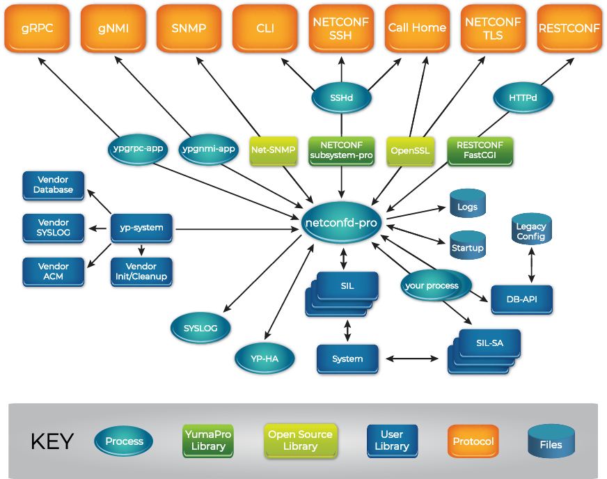
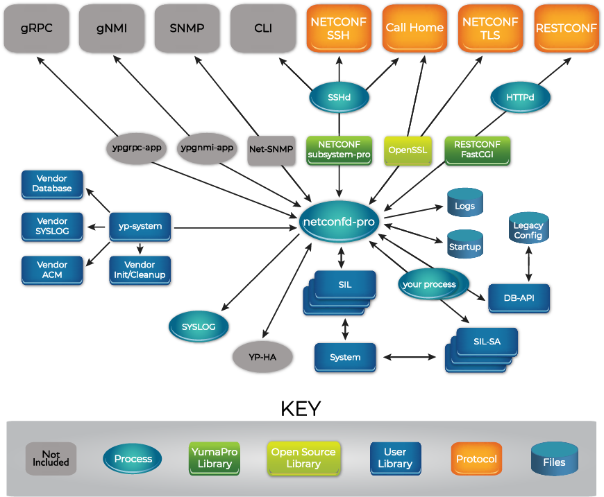
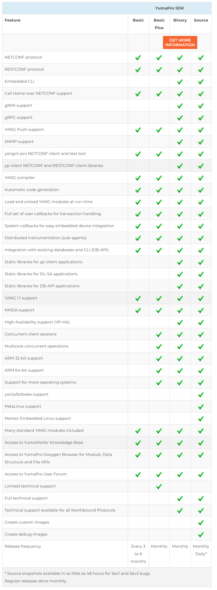

# YumaPro SDK from YumaWorks

Hello

## Introduction

[YumaWorks](https://www.yumaworks.com/) is a company that offers a suite of network management
and control plane automation tools, with a focus on YANG, NETCONF, and RESTCONF.

Their product [YumaPro SDK](https://www.yumaworks.com/tools/multi-protocol-server/)
(Software Development Kit), also referred to as the
multi-protocol network management server toolkit or simply the multi-protocol server,
is a network automation management platform that provides developers a framework for developing
device management interfaces.

YumaPro SDK consists of the following components:



YumaPro SDK is available in binary and in source code.

YumaPro SDK Basic offers a subset of the
YumaPro SDK features and can be used for free for internal use subject to restrictions
(see the
[license document](https://www.yumaworks.com/download/yumapro-sdk-basic-license/)
for details):





In this tutorial we will be using the basic version.

## Download the YumaWorks software and documentation

Download the YumaPro SDK Basic software and documentation from the
[download page](https://www.yumaworks.com/support/download-yumapro-sdk-basic/)
It is available for several Linux distributions; we use Ubuntu 20.04.

Note: we had to use FireFox for the download; when using Chrome the checkbox to agree with the
license agreement does not appear when you scroll down to the bottom of the agreement.

As of 13 March 2023, this downloads files 
`yumapro-sdk-basic-21.10-12.u2204.amd64.deb` (the software) and
`yumapro-doc_21.10-8_all.deb` (the documentation).

## Install the software and documentation

Follow the instructions on the
[installation guide](https://www.yumaworks.com/pub/latest/install/yumapro-installation-guide.html)
page.

Update `apt-get` (the instructions don't mention this, but always a prudent first step):

<pre>
$ <b>sudo apt-get update</b>
</pre>

Install `libxml2`:

<pre>
$ <b>sudo apt-get install -y libxml2-dev</b>
</pre>

Install `openssh-server`:

<pre>
$ <b>sudo apt-get install -y openssh-server</b>
</pre>

Install `openssl` and `libssl-dev` (the instructions ask to install `openssl-dev` but that does
not work on Ubuntu):

<pre>
$ <b>sudo apt-get install -y openssl libssl-dev</b>
</pre>

Install `libcurl4-gnutls-dev`:

<pre>
$ <b>sudo apt-get install -y libcurl4-gnutls-dev</b>
</pre>

Install `libfcgi-dev`:

<pre>
$ <b>sudo apt-get install -y libfcgi-dev</b>
</pre>

Install `libssh2-1-dev`:

<pre>
$ <b>sudo apt-get install -y libssh2-1-dev</b>
</pre>

Install `libncurses5-dev`:

<pre>
$ <b>sudo apt-get install -y libncurses5-dev</b>
</pre>

Install `zlib1g-dev`:

<pre>
$ <b>sudo apt-get install -y zlib1g-dev</b>
</pre>

Install the YumaPro SDK Basic software package:

<pre>
$ <b>sudo dpkg -i ~/Downloads/yumapro-sdk-basic-21.10-12.u2204.amd64.deb</b>
</pre>

Verify that YumaPro SDK Basic has been installed:

<pre>
$ <b>/usr/sbin/netconfd-pro --version</b>

Starting netconfd-pro...
Copyright (c) 2008-2012, Andy Bierman, All Rights Reserved.
Copyright (c) 2012-2022, YumaWorks, Inc., All Rights Reserved.

netconfd-pro version 21.10-8-1fcb
</pre>

Install the YumaPro SDK Basic documentation package
(note the `--force-overwrite` option is needed because the software package installed some
documentation files with the same file names):

<pre>
$ <b>sudo dpkg -i --force-overwrite ~/Downloads/yumapro-doc_21.10-8_all.deb</b>
</pre>

Configure SSH:

Edit sshd_config, for example using `vi`:

<pre>
$ <b>sudo vi /etc/ssh/sshd_config</b>
</pre>

The installation guide instructs you to add the following lines:

<pre>
Port 22
Port 830
Subsystem netconf /usr/sbin/netconf-subsystem-pro
</pre>

Using the following `Subsystem` configuration instead will allow you to view the XML messages that
are exchanged over the SSH system (this cannot easily be done with normal packet capture tools such
as Wireshark because they cannot easily decode the encrypted SSH session):

<pre>
Subsystem netconf "/bin/sh -c 'tee /tmp/netconf-rx.txt | /usr/sbin/netconf-subsystem-pro` | tee /tmp/netconf-tx.txt'"
</pre>

TODO: The above does not seem to work

The NETCONF server will write all received XML messages to file `/tmp/netconf-rx.txt` and all
sent XML messages to file `/tmp/netconf-tx.txt`.

The `multitail` program is handy to monitor both files at the same time.

Install `multitail`:

<pre>
$ <b>sudo apt-get install -y multitail</b>
</pre>

Monitor both files at the same time using different colors:

<pre>
$ <b></b>
</pre>

Press `F1` to get help on the interactive keys that multitail supports. Some handy keys are `B` to
scroll back and `N` to clear the window.

Generate SSH keys (accept defaults for all prompts):

<pre>
$ <b>ssh-keygen</b>
Generating public/private rsa key pair.
Enter file in which to save the key (/home/parallels/.ssh/id_rsa): 
Enter passphrase (empty for no passphrase): 
Enter same passphrase again: 
Your identification has been saved in /home/parallels/.ssh/id_rsa
Your public key has been saved in /home/parallels/.ssh/id_rsa.pub
The key fingerprint is:
SHA256:AmezkogmPbMOZhxTcrf00DTydqxv0MyC4j7qTL4NRJA parallels@parallels-Parallels-Virtual-Platform
The key's randomart image is:
+---[RSA 3072]----+
|..   . o         |
|E     = o        |
| o o.+++ o       |
|.o+.o=*o*        |
|o==.ooo=S+       |
|= ++.. .+        |
|.*..     o       |
|*o+.    .        |
|.*+o.            |
+----[SHA256]-----+
</pre>

Restart SSH:

<pre>
$ <b>sudo service ssh restart</b>
</pre>

## Start the server

Start the `netconfd-pro` server (with maximum debug logging; use `debug` instead of `debug4` to
reduce the verbosity):

<pre>
$ <b>netconfd-pro --log-level=debug4 --access-control=off</b>

Starting netconfd-pro...
Copyright (c) 2008-2012, Andy Bierman, All Rights Reserved.
Copyright (c) 2012-2022, YumaWorks, Inc., All Rights Reserved.

<i>...lots of output...</i>

netconfd-pro init OK, ready for sessions

Running netconfd-pro server (21.10-8-1fcb)

Binding to AF_LOCAL socket /tmp/ncxserver.sock

agt_ncxserver: listen ncxsock fd: 3
</pre>

## Start the command line interface (CLI) client

In a separate Terminal window, start the `yangcli-pro` client:

<pre>
$ <b>yangcli-pro</b>
  
  yangcli-pro version 21.10-8
  libssh2 version 1.8.0

  Copyright (c) 2008-2012, Andy Bierman, All Rights Reserved.
  Copyright (c) 2012-2022, YumaWorks, Inc., All Rights Reserved.

<i>...more output...</i>

parallels@localhost&gt;
</pre>

## Connect the CLI client to the NETCONF server

Enter the following command in the CLI to connect to the server
(use your Linux username and password, and put the password in quotes if it contains a question mark):

<pre>
parallels@localhost&gt; <b>connect server=localhost user=</b><i>&lt;username&gt;</i><b> password</b>=<i>&lt;password&gt;</i></b>

NETCONF 1.1 session established for parallels on localhost

Client Session Id: 1
Server Session Id: 4

<i>...more output...</i>

Protocol version set to: RFC 6241 (base:1.1)
Default target set to: <candidate>
Save operation mapped to: commit
Default with-defaults behavior: explicit
Additional with-defaults behavior: trim,report-all,report-all-tagged
YANG library set to: 1.0 (RFC 7895)
module-set-id: 4269
</pre>

The client sends a `hello`:

```xml
<hello xmlns="urn:ietf:params:xml:ns:netconf:base:1.0">
  <capabilities>
    <capability>urn:ietf:params:netconf:base:1.0</capability>
    <capability>urn:ietf:params:netconf:base:1.1</capability>
  </capabilities>
</hello>
```

Note: throughout these examples, we have used the `xmllint` program to pretty-print the XML in
the NETCONF messages. One side-effect of this is that the XML elements and attributes may appear
in a different order.

The server responds with a `hello`:

```xml
<hello xmlns="urn:ietf:params:xml:ns:netconf:base:1.0">
  <capabilities>
    <capability>urn:ietf:params:netconf:base:1.0</capability>
    <capability>urn:ietf:params:netconf:base:1.1</capability>
    <capability>urn:ietf:params:netconf:capability:candidate:1.0</capability>
    <capability>urn:ietf:params:netconf:capability:confirmed-commit:1.0</capability>
    <capability>urn:ietf:params:netconf:capability:confirmed-commit:1.1</capability>
    <capability>urn:ietf:params:netconf:capability:rollback-on-error:1.0</capability>
    <capability>urn:ietf:params:netconf:capability:validate:1.0</capability>
    <capability>urn:ietf:params:netconf:capability:validate:1.1</capability>
    <capability>urn:ietf:params:netconf:capability:url:1.0?scheme=file</capability>
    <capability>urn:ietf:params:netconf:capability:xpath:1.0</capability>
    <capability>urn:ietf:params:netconf:capability:notification:1.0</capability>
    <capability>urn:ietf:params:netconf:capability:interleave:1.0</capability>
    <capability>urn:ietf:params:netconf:capability:partial-lock:1.0</capability>
    <capability>urn:ietf:params:netconf:capability:with-defaults:1.0?basic-mode=explicit&amp;also-supported=trim,report-all,report-all-tagged</capability>
    <capability>urn:yumaworks:params:xml:ns:netconf:config-id?id=13</capability>
    <capability>urn:ietf:params:xml:ns:netconf:base:1.0?module=ietf-netconf&amp;revision=2011-06-01&amp;features=candidate,confirmed-commit,rollback-on-error,validate,url,xpath</capability>
    <capability>urn:ietf:params:xml:ns:yang:iana-crypt-hash?module=iana-crypt-hash&amp;revision=2014-08-06&amp;features=crypt-hash-md5,crypt-hash-sha-256,crypt-hash-sha-512</capability>
    <capability>urn:ietf:params:xml:ns:yang:ietf-inet-types?module=ietf-inet-types&amp;revision=2013-07-15</capability>
    <capability>urn:ietf:params:xml:ns:yang:ietf-netconf-acm?module=ietf-netconf-acm&amp;revision=2018-02-14</capability>
    ...
    <capability>http://yumaworks.com/ns/yumaworks-types?module=yumaworks-types&amp;revision=2021-05-15</capability>
    <capability>urn:ietf:params:netconf:capability:yang-library:1.0?revision=2016-06-21&amp;module-set-id=4269</capability>
  </capabilities>
  <session-id>5</session-id>
</hello>
```

The client issues a `get` filtering on subtree `ietf-yang-library`
to retrieve the details of the modules that the server supports
(see [RFC8525](https://datatracker.ietf.org/doc/rfc8525/) for details)
(output truncated):

```xml
<rpc xmlns="urn:ietf:params:xml:ns:netconf:base:1.0" message-id="1">
  <get>
    <filter type="subtree">
      <modules-state xmlns="urn:ietf:params:xml:ns:yang:ietf-yang-library"/>
    </filter>
  </get>
</rpc>
```

The server responds with the requested information (output truncated):

```xml
<rpc-reply xmlns:ncx="http://netconfcentral.org/ns/yuma-ncx" xmlns="urn:ietf:params:xml:ns:netconf:base:1.0" message-id="1" ncx:last-modified="2022-09-09T15:04:23Z" ncx:etag="13">
  <data>
    <modules-state xmlns="urn:ietf:params:xml:ns:yang:ietf-yang-library">
      <module-set-id>4269</module-set-id>
      <module>
        <name>ietf-netconf</name>
        <revision>2011-06-01</revision>
        <namespace>urn:ietf:params:xml:ns:netconf:base:1.0</namespace>
        <feature>candidate</feature>
        <feature>confirmed-commit</feature>
        <feature>rollback-on-error</feature>
        <feature>validate</feature>
        <feature>url</feature>
        <feature>xpath</feature>
        <conformance-type>implement</conformance-type>
      </module>
      <module>
        <name>iana-crypt-hash</name>
        <revision>2014-08-06</revision>
        <schema>http://localhost/restconf/yang/iana-crypt-hash/2014-08-06</schema>
        <namespace>urn:ietf:params:xml:ns:yang:iana-crypt-hash</namespace>
        <feature>crypt-hash-md5</feature>
        <feature>crypt-hash-sha-256</feature>
        <feature>crypt-hash-sha-512</feature>
        <conformance-type>implement</conformance-type>
      </module>
      <module>
        <name>ietf-inet-types</name>
        <revision>2013-07-15</revision>
        <schema>http://localhost/restconf/yang/ietf-inet-types/2013-07-15</schema>
        <namespace>urn:ietf:params:xml:ns:yang:ietf-inet-types</namespace>
        <conformance-type>import</conformance-type>
      </module>
      <module>
        <name>ietf-netconf-acm</name>
        <revision>2018-02-14</revision>
        <schema>http://localhost/restconf/yang/ietf-netconf-acm/2018-02-14</schema>
        <namespace>urn:ietf:params:xml:ns:yang:ietf-netconf-acm</namespace>
        <conformance-type>implement</conformance-type>
      </module>
      ...
      <module>
        <name>yumaworks-types</name>
        <revision>2021-05-15</revision>
        <schema>http://localhost/restconf/yang/yumaworks-types/2021-05-15</schema>
        <namespace>http://yumaworks.com/ns/yumaworks-types</namespace>
        <conformance-type>import</conformance-type>
      </module>
    </modules-state>
  </data>
</rpc-reply>
```

In the CLI client, the `show modules` command can be used to view the YANG modules that the
server reports:

<pre>
parallels@localhost&gt; <b>show modules</b>

  ianach:iana-crypt-hash@2014-08-06
  inet:ietf-inet-types@2013-07-15
  nacm:ietf-netconf-acm@2018-02-14
  ncm:ietf-netconf-monitoring@2010-10-04
  ncn:ietf-netconf-notifications@2012-02-06
  pl:ietf-netconf-partial-lock@2009-10-19
  ncwd:ietf-netconf-with-defaults@2011-06-01
  rc:ietf-restconf@2017-01-26
  rcmon:ietf-restconf-monitoring@2017-01-26
  yanglib:ietf-yang-library@2016-06-21
  ypatch:ietf-yang-patch@2017-02-22
  sx:ietf-yang-structure-ext@2020-06-17
  yang:ietf-yang-types@2013-07-15
  manageEvent:nc-notifications@2008-07-14
  ncEvent:notifications@2013-03-15
  yd:yang-data-ext@2017-07-03
  appcmn:yuma-app-common@2017-07-25
  ncx:yuma-ncx@2015-10-16
  nc:yuma-netconf@2015-04-30
  timefilter:yuma-time-filter@2012-11-15
  yt:yuma-types@2019-11-29
  ywapp:yumaworks-app-common@2021-08-24
  ef:yumaworks-event-filter@2014-02-09
  ywes:yumaworks-event-stream@2021-05-15
  ywx:yumaworks-extensions@2021-12-14
  ybulk:yumaworks-getbulk@2021-08-07
  yid:yumaworks-ids@2014-07-12
  yrc:yumaworks-restconf@2017-07-03
  yss:yumaworks-support-save@2017-07-27
  ysys:yumaworks-system@2022-03-08
  ytemp:yumaworks-templates@2017-02-20
  ytm:yumaworks-term-msg@2019-05-05
  ywt:yumaworks-types@2021-05-15
</pre>

## Retrieve the (empty) configuration

In the CLI client, issue a `get-config` command to retrieve the running configuration:

<pre>
parallels@localhost&gt; <b>get-config source=running</b>

RPC Data Reply 10 for session 4 [default]: 

rpc-reply {
  data {
  }
}
</pre>

In this example, there is no configuration yet (we will add some configuration below).

The client sends a `get-config`:

```xml
<rpc xmlns="urn:ietf:params:xml:ns:netconf:base:1.0" message-id="2">
  <get-config>
    <source>
      <running/>
    </source>
  </get-config>
</rpc>
```

The server responds with the requested configuration:

```xml
<rpc-reply xmlns:ncx="http://netconfcentral.org/ns/yuma-ncx" xmlns="urn:ietf:params:xml:ns:netconf:base:1.0" message-id="2" ncx:last-modified="2022-09-09T15:04:23Z" ncx:etag="13">
  <data/>
</rpc-reply>
```

## Retrieve a subtree of the operational state

In the CLI client, issue an `sget` command to retrieve operational state for the 
`/netconf-state/sessions` subtree of the operational state tree (use `/` if you want to see the 
whole tree):

<pre>
parallels@localhost&gt; <b>sget /netconf-state/sessions</b>

Filling container /netconf-state/sessions:
RPC Data Reply 2 for session 4 [default]: 

rpc-reply {
  data {
    netconf-state {
      sessions {
        session  4 {
          session-id 4
          transport ncm:netconf-ssh
          username parallels
          source-host 127.0.0.1
          login-time 2022-09-08T14:09:15Z
          in-rpcs 1
          in-bad-rpcs 0
          out-rpc-errors 0
          out-notifications 0
        }
      }
    }
  }
}
</pre>

The client sends a `get` with the filter for the subtree:

```xml
<rpc xmlns="urn:ietf:params:xml:ns:netconf:base:1.0" message-id="3">
  <get>
    <filter type="subtree">
      <netconf-state xmlns="urn:ietf:params:xml:ns:yang:ietf-netconf-monitoring">
        <sessions/>
      </netconf-state>
    </filter>
  </get>
</rpc>
```

The server responds with the requested operational state:

```xml
<rpc-reply xmlns:ncx="http://netconfcentral.org/ns/yuma-ncx" xmlns="urn:ietf:params:xml:ns:netconf:base:1.0" message-id="3" ncx:last-modified="2022-09-09T15:04:23Z" ncx:etag="13">
  <data>
    <netconf-state xmlns="urn:ietf:params:xml:ns:yang:ietf-netconf-monitoring">
      <sessions>
        <session>
          <session-id>5</session-id>
          <transport xmlns:ncm="urn:ietf:params:xml:ns:yang:ietf-netconf-monitoring">ncm:netconf-ssh</transport>
          <username>parallels</username>
          <source-host>127.0.0.1</source-host>
          <login-time>2022-09-09T15:07:13Z</login-time>
          <in-rpcs>2</in-rpcs>
          <in-bad-rpcs>0</in-bad-rpcs>
          <out-rpc-errors>0</out-rpc-errors>
          <out-notifications>0</out-notifications>
        </session>
      </sessions>
    </netconf-state>
  </data>
</rpc-reply>
```

## Retrieve the YANG schema for a module

In the CLI client, issue the `get-schema` command to retrieve the YANG schema for a specific
module from the server:

<pre>
parallels@localhost&gt; <b>get-schema identifier=ietf-netconf-notifications</b>

RPC Data Reply 10 for session 5 [default]: 

rpc-reply {
  data '
module ietf-netconf-notifications {

   namespace
     "urn:ietf:params:xml:ns:yang:ietf-netconf-notifications";

   prefix ncn;

   import ietf-inet-types { prefix inet; }
   import ietf-netconf { prefix nc; }

   organization
     "IETF NETCONF (Network Configuration Protocol) Working Group";

   contact
     "WG Web:   &lt;http://tools.ietf.org/wg/netconf/&gt;
      WG List:  &lt;mailto:netconf@ietf.org&gt;

      WG Chair: Bert Wijnen
                &lt;mailto:bertietf@bwijnen.net&gt;

      WG Chair: Mehmet Ersue
                &lt;mailto:mehmet.ersue@nsn.com&gt;

      Editor:   Andy Bierman
                &lt;mailto:andy@netconfcentral.org&gt;";

   description
     "This module defines a YANG data model for use with the
      NETCONF protocol that allows the NETCONF client to
      receive common NETCONF base event notifications.

      Copyright (c) 2012 IETF Trust and the persons identified as
      the document authors.  All rights reserved.

      Redistribution and use in source and binary forms, with or
      without modification, is permitted pursuant to, and subject
      to the license terms contained in, the Simplified BSD License
      set forth in Section 4.c of the IETF Trust's Legal Provisions
      Relating to IETF Documents
      (http://trustee.ietf.org/license-info).

      This version of this YANG module is part of RFC 6470; see
      the RFC itself for full legal notices.";

   revision "2012-02-06" {
     description
       "Initial version. Errata 3957 added.";
     reference
       "RFC 6470: NETCONF Base Notifications";
   }

  grouping common-session-parms {
    description
      "Common session parameters to identify a
       management session.";

    leaf username {
      type string;
      mandatory true;
      description
        "Name of the user for the session.";
    }

    leaf session-id {
      type nc:session-id-or-zero-type;
      mandatory true;
      description
        "Identifier of the session.
         A NETCONF session MUST be identified by a non-zero value.
         A non-NETCONF session MAY be identified by the value zero.";
    }

    ...

    leaf timeout {
      when
        "../confirm-event = 'start' or ../confirm-event = 'extend'";
      type uint32;
      units "seconds";
      description
        "The configured timeout value if the event type
         is 'start' or 'extend'.  This value represents
         the approximate number of seconds from the event
         time when the 'timeout' event might occur.";
    }
  } // notification netconf-confirmed-commit

}
'
}
</pre>

The client sends a `get-schema` for the module:

```xml
<rpc xmlns="urn:ietf:params:xml:ns:netconf:base:1.0" message-id="11">
  <get-schema xmlns="urn:ietf:params:xml:ns:yang:ietf-netconf-monitoring">
    <identifier>ietf-netconf-notifications</identifier>
  </get-schema>
</rpc>
```

The server responds with the requested schema:

```xml
<rpc-reply xmlns="urn:ietf:params:xml:ns:netconf:base:1.0" message-id="11">
  <data xmlns="urn:ietf:params:xml:ns:yang:ietf-netconf-monitoring">
module ietf-netconf-notifications {

   namespace
     "urn:ietf:params:xml:ns:yang:ietf-netconf-notifications";

   prefix ncn;

   import ietf-inet-types { prefix inet; }
   import ietf-netconf { prefix nc; }

   organization
     "IETF NETCONF (Network Configuration Protocol) Working Group";

   contact
     "WG Web:   &lt;http://tools.ietf.org/wg/netconf/&gt;
      WG List:  &lt;mailto:netconf@ietf.org&gt;

      WG Chair: Bert Wijnen
                &lt;mailto:bertietf@bwijnen.net&gt;

      WG Chair: Mehmet Ersue
                &lt;mailto:mehmet.ersue@nsn.com&gt;

      Editor:   Andy Bierman
                &lt;mailto:andy@netconfcentral.org&gt;";

   description
     "This module defines a YANG data model for use with the
      NETCONF protocol that allows the NETCONF client to
      receive common NETCONF base event notifications.

      Copyright (c) 2012 IETF Trust and the persons identified as
      the document authors.  All rights reserved.

      Redistribution and use in source and binary forms, with or
      without modification, is permitted pursuant to, and subject
      to the license terms contained in, the Simplified BSD License
      set forth in Section 4.c of the IETF Trust's Legal Provisions
      Relating to IETF Documents
      (http://trustee.ietf.org/license-info).

      This version of this YANG module is part of RFC 6470; see
      the RFC itself for full legal notices.";

   revision "2012-02-06" {
     description
       "Initial version. Errata 3957 added.";
     reference
       "RFC 6470: NETCONF Base Notifications";
   }

  grouping common-session-parms {
    description
      "Common session parameters to identify a
       management session.";

    leaf username {
      type string;
      mandatory true;
     
 description
        "Name of the user for the session.";
    }

    leaf session-id {
      type nc:session-id-or-zero-type;
      mandatory true;
      description
        "Identifier of the session.
         A NETCONF session MUST be identified by a non-zero value.
         A non-NETCONF session MAY be identified by the value zero.";
    }

    ...

    leaf timeout {
      when
        "../confirm-event = 'start' or ../confirm-event = 'extend'";
      type uint32;
      units "seconds";
      description
        "The configured timeout value if the event type
         is 'start' or 'extend'.  This value represents
         the approximate number of seconds from the event
         time when the 'timeout' event might occur.";
    }
  } // notification netconf-confirmed-commit

}
  </data>
</rpc-reply>
```

## Exit from the CLI client

Exit from the CLI client:

<pre>
parallels@localhost&gt; <b>quit</b>
</pre>

## Adding a plugin for your own data model

We will now add a plugin for our example YANG data model: [interfaces.yang](../interfaces.yang),
following the instructions in the
[YumaPro Developer Manual](https://www.yumaworks.com/pub/latest/dev/yumapro-dev-manual.html)
.

If you haven't already done so, clone the `yang-tutorial` repo:

<pre>
$ <b>cd ~</b>
$ <b>git clone https://github.com/brunorijsman/yang-tutorial.git</b>
</pre>

By default YumaPro SDK expects the YANG data models to be installed in `~/modules`.
Copy the example YANG data model [interfaces.yang](../interfaces.yang) into `~/modules`:

<pre>
$ <b>mkdir ~/modules</b>
$ <b>cd ~/modules</b>
$ <b>cp ~/yang-tutorial/interfaces.yang .</b>
</pre>

YumaPro SDK support a few different flavors of plugins.
We will use the SIL flavor, which is dynamically linked into the NETCONF server and which uses
synchronous callbacks.

We will put our plugin code in the `~/plugins` directory:

<pre>
$ <b>mkdir ~/plugins</b>
$ <b>cd ~/plugins</b>
</pre>

Run the YumaWorks `make_sil_dir_pro` script to generate the C stub code from the YANG data model:

<pre>
$ <b>make_sil_dir_pro interfaces --sil-get2 --sil-edit2</b>
</pre>

If all goes well, this generates the following directories and files:

<pre>
$ <b>tree interfaces</b>
interfaces/
├── bin
├── lib
├── Makefile
└── src
    ├── Makefile
    ├── u_interfaces.c
    ├── u_interfaces.h
    ├── y_interfaces.c
    └── y_interfaces.h
</pre>

The files starting with `u_` (for user) can be edited to customize the behavior of the plugin.
We will edit the stub C code that YumaPro SDK generated to provide values for the operational
state attributes.
There are many other callbacks that can be edited in the stub code, for example to do something
when an interface is added or removed, when an IPv4 address is set, changed, or removed, etc.
For a complete list of all the callbacks that can be customized see the
[YumaPro Developers Manual](https://www.yumaworks.com/pub/latest/dev/yumapro-dev-manual.html#)
.
For now, we will keep it as simple as possible and only implement the callback for providing packet
counter values.

Edit the generated stub file `u_interfaces.c`:

<pre>
$ <b>vi ~/plugins/interfaces/src/u_interfaces.c</b>
</pre>

Edit function `u_intf_sent_packets_get`:

```c
status_t u_intf_sent_packets_get (
    getcb_get2_t *get2cb,
    const xmlChar *k_intf_name)
{
...
}
```

Change the following lines:

```c
    /* check if the requested node exists; determined by the
     * SIL or SIL-SA callback based on instances in the system
     * CHANGE node_exists TO TRUE WHEN VALUE CODE FILLED IN */
    boolean node_exists = FALSE;

    if (!node_exists) {
        return ERR_NCX_NO_INSTANCE;
    }

    obj_template_t *obj = GETCB_GET2_OBJ(get2cb);
    status_t res = NO_ERR;

    /* get the real value from the system somehow */
    uint64 v_sent_packets = 0;
```

Into the following lines (to keep things as simple as possible, we return a random value for the
number of sent packets counter):

```c
    /* check if the requested node exists; determined by the
     * SIL or SIL-SA callback based on instances in the system
     * CHANGE node_exists TO TRUE WHEN VALUE CODE FILLED IN */
    boolean node_exists = TRUE;                          // <<< Changed this line

    if (!node_exists) {
        return ERR_NCX_NO_INSTANCE;
    }

    obj_template_t *obj = GETCB_GET2_OBJ(get2cb);
    status_t res = NO_ERR;

    /* get the real value from the system somehow */
    uint64 v_sent_packets = rand() % 1000;               // <<< Changed this line
```

Make a similar change in the function `u_intf_received_packets_get`:

```c
    /* check if the requested node exists; determined by the
     * SIL or SIL-SA callback based on instances in the system
     * CHANGE node_exists TO TRUE WHEN VALUE CODE FILLED IN */
    boolean node_exists = TRUE;

    if (!node_exists) {
        return ERR_NCX_NO_INSTANCE;
    }

    obj_template_t *obj = GETCB_GET2_OBJ(get2cb);
    status_t res = NO_ERR;

    /* get the real value from the system somehow */
    uint64 v_received_packets = rand() % 1000;
```

Save the changes.

Build and install the plugin (the `make` step generates some warnings about unused parameters
which you can ignore for now):

<pre>
$ <b>cd interfaces</b>
$ <b>make</b>
$ <b>sudo make install</b>
</pre>

Go back to the CLI client which we started earlier in this tutorial and issue the following
command to instruct the NETCONF server to load the new YANG module:

<pre>
parallels@localhost&gt; <b>load interfaces</b>

RPC Data Reply 5 for session 4 [default]: 

rpc-reply {
  mod-revision 2022-03-12
}
</pre>

We separate need to load the YANG module into the CLI client:

<pre>
parallels@localhost&gt; <b>mgrload interfaces</b>

Load module 'interfaces' OK
</pre>

Note: instead of issuing CLI commands to load the YANG module into the server and the client, we
can also start the server with a `--module` command line option:

<pre>
$ <b>netconfd-pro --log-level=debug4 --access-control=off --module=interfaces</b>
</pre>

Still in the CLI client, configure a couple of interfaces:

<pre>
parallels@localhost&gt; <b>config term</b>
parallels@localhost# <b>interfaces</b>
parallels@localhost(interfaces)# <b>interface eth0</b>
parallels@localhost(interface)# <b>ipv4-address 1.1.1.1</b>
parallels@localhost(interface)# <b>exit</b>
parallels@localhost(interfaces)# <b>interface eth1</b>
parallels@localhost(interface)# <b>ipv4-address 2.2.2.2</b>
parallels@localhost(interface)# <b>exit</b>
parallels@localhost(interfaces)# <b>exit</b>
parallels@localhost# <b>exit</b>
parallels@localhost> <b>commit</b>
RPC OK Reply 7 for session 4 [default]:
</pre>

Get the configuration to double check:

<pre>
parallels@localhost&gt; <b>sget-config source=running /interfaces</b>

Filling container /interfaces:
RPC Data Reply 3 for session 5 [default]: 

rpc-reply {
  data {
    interfaces {
      interface  eth0 {
        name eth0
        ipv4-address 1.1.1.1
      }
      interface  eth1 {
        name eth1
        ipv4-address 2.2.2.2
      }
    }
  }
}
</pre>

Get the operational state for the interfaces; we get random values for the packet counters:

<pre>
parallels@localhost&gt; <b>sget /interfaces</b>

Filling container /interfaces:
RPC Data Reply 29 for session 3 [default]: 

rpc-reply {
  data {
    interfaces {
      interface  eth0 {
        name eth0
        ipv4-address 1.1.1.1
        sent-packets 383
        received-packets 886
      }
      interface  eth1 {
        name eth1
        ipv4-address 2.2.2.2
        sent-packets 777
        received-packets 915
      }
    }
  }
}
</pre>

