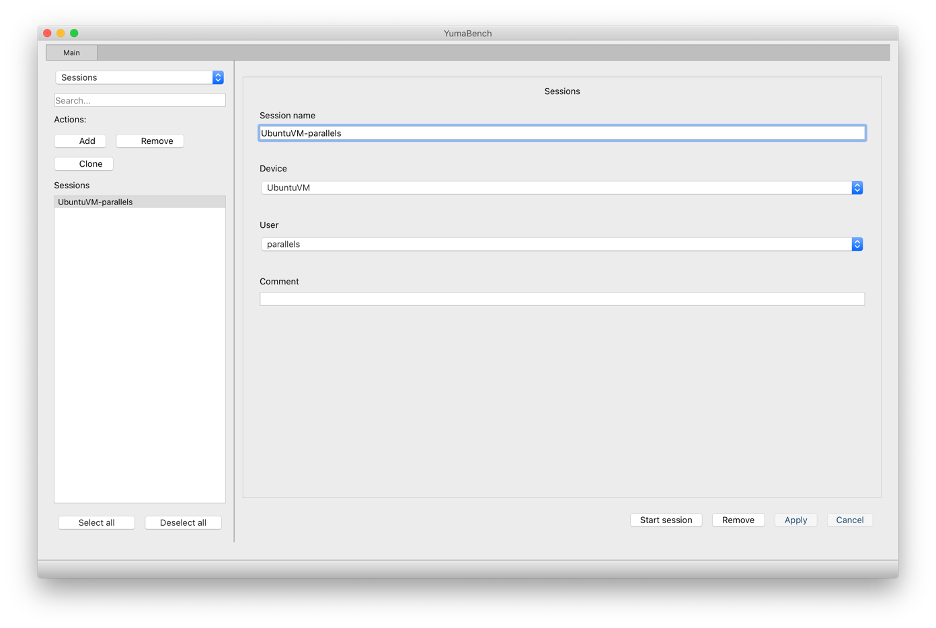

# YumaWorks YumaBench

## Introduction

[YumaWorks](https://www.yumaworks.com/) is a company that specializes in YANG management tools.
One of their products, [YumaBench](https://www.yumaworks.com/tools/yumabench/) is a 
NETCONF client that can connect to a NETCONF server and that offers a graphical user interface
for exploring and editing the data store in the NETCONF server.
At the time of writing of this tutorial (March 2022) an early release version of YumaBench can be
downloaded for free. Because it is an early release version,
the product is still a bit rough around the edges and support is on a best-effort basis.

## Download and install YumaBench

You can download YumaBench from the 
[download page](https://www.yumaworks.com/support/download-yumabench/)
on the YumaWorks website.
Downloads are available for Ubuntu/Debian, RedHat/CentOS/Fedora, and macOS
(I used the macOS version).

The installation instructions are on the same
[download page](https://www.yumaworks.com/support/download-yumabench/).
The macOS installer requires you to run two shell scripts from a terminal window:
`yumabench-setup` and `yuma-bench-installer`. The `yuma-bench-installer` produces an error
message "cannot be opened because the developer cannot be verified".
To work around this, go to _General_ tab in the _Security and privacy_ pane of the
_System preferences_ macOS application, and click on 
"Allow anyway" next to "yuma-bench-installer was blocked".

There are also more detailed instructions in the
[YumaBench User Manual](https://www.yumaworks.com/pub/docs/yumabench/yumabench-user-manual.pdf)

## Initial configuration of YumaBench

To start YumaBench, type the command `yuma-bench` in a terminal window.

When you start YumaBench for the first time, it will ask you for the details of the managed
device (e.g. name and address) and the details of the user (e.g. username and password).
You can add additional devices and users later on.

The YumaBench initial startup screen looks as follows:

In this example, I created a device called UbuntuVM and a user called parallels, so there is
one session UbuntuVM-parallels.

## Start the NETCONF session

Click on the session (UbuntuVM-parallels in this example) and then on "Start Session" button.

This brings up the session window:

**TODO**: I am supposed to see the full YANG data model tree here. I should probably load the YANG
data model first (at least, this is how it works in MG-SOFT). But I cannot figure out how to do
that. Chapter 4 in the
[user manual](https://www.yumaworks.com/pub/docs/yumabench/yumabench-user-manual.pdf)
seems to indicate that I should use the menu options "SDK -> SIL/SIL-SA -> Module/Bundle" to
add the YANG data model, but those options are always grayed out in the early release version
of YumaBench that I have. Note that the monitoring tab does should the full YANG model hierarchy.

