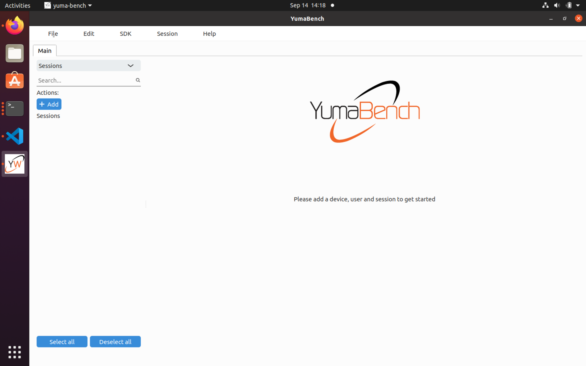
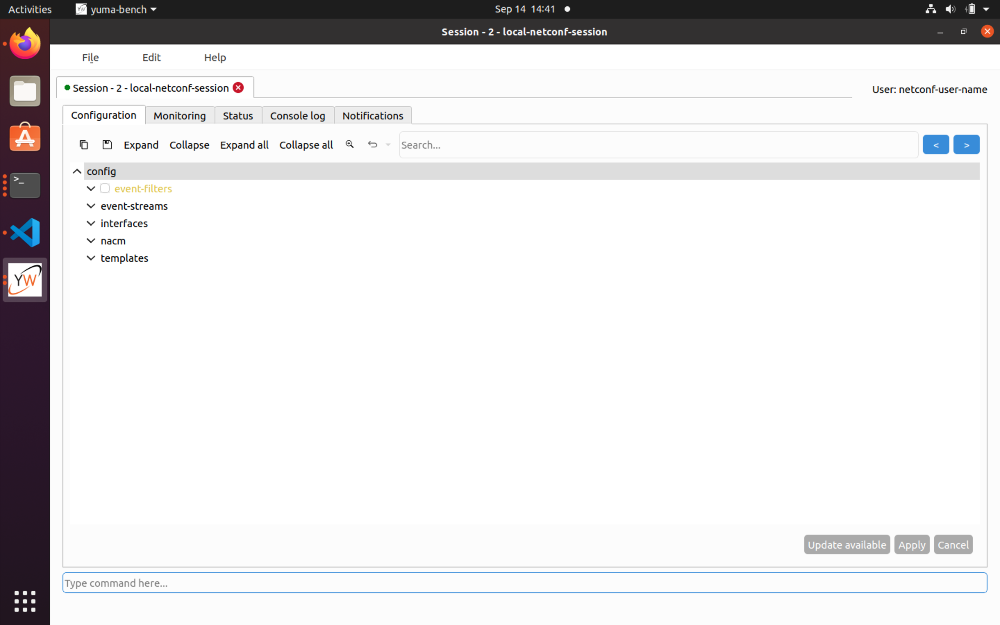

# YumaWorks YumaBench

## Introduction

[YumaWorks](https://www.yumaworks.com/) is a company that specializes in YANG management tools.

One of their products,
[YumaBench](https://www.yumaworks.com/tools/yumabench/)
is a 
NETCONF client that can connect to a NETCONF server and that offers a graphical user interface
for exploring and editing the data store in the NETCONF server.

## Download and install YumaBench

The
[YumaBench page](https://www.yumaworks.com/tools/yumabench/)
contains links to download the software and installation instructions.
Additional instructions are in the
[user manual](https://www.yumaworks.com/pub/docs/yumabench/yumabench-user-manual.pdf)
.
Downloads are available for Ubuntu/Debian, RedHat/CentOS/Fedora, and macOS.
We used the Ubuntu version.

## Start a NETCONF server

This YumaBench tutorial assumes that there is a NETCONF server running that YumaBench can
connect to.
See the
[YumaPro SDK](yuma-pro-sdk.md)
tutorial for instructions on how to start the YumaWorks NETCONF server and how to load
our simple `interfaces.yang` example YANG module into that server.

## Start YumaBench

To start YumaBench, type the command `yuma-bench` in a terminal window.

The YumaBench initial startup screen looks as follows:

## Initial setup of YumaBench

We need to configure YumaBench with the device to manage (in this case the NETCONF server running
locally), user credentials (a user name and password in this example, but other authentication
mechanisms are supported as well), and a NETCONF session.

Add a device by selecting _Devices_ from the dropdown menu and clicking on the +Add button:

Enter the device details as follows and click the Apply button:

Add a user by selecting _Users_ from the dropdown menu and clicking on the +Add button.
Enter the user details and click the Apply button:

Add a session by selecting _Sessions_ from the dropdown menu and clicking on the +Add button.
Enter the session details and click the Apply button:

## Start the NETCONF session

On the same screen where the session was just added, click on the Start "Start session" button.
This brings up the session window:

We start in the configuration tab, and we see that we can configure event-filters, event-streams,
interfaces (which is the example YANG data model used in this tutorial), nacm, and templates.

Note that we did not have to configure or import any YANG modules in the YumaBench browser;
instead the browser uses the NETCONF protocol to automatically discover which YANG modules
the device supports and to download the corresponding YANG data models from the device.
This is only possible if the device supports
[RFC 7895 (YANG Library)](https://datatracker.ietf.org/doc/rfc8525/)
(which the YumaPro SDK NETCONF server used
in this example does).

## Add some interfaces

We will now add an interface to our example interfaces YANG module.

First click on interfaces in the tree to expand it.
A new entry interface appears in the tree; click on this to expand it as well.
The name and ipv4-address fields appear in the tree.
Fill them as follows and click on the Apply button:

Note that the interface labels change from orange to black after applying the changes to
indicate that the changes have been committed.

Add another interface, by selecting interface and clicking the Add button.
Fill in the details of the new interface and click Apply.

## Change an interface

To change one or more interface attributes, click on the attribute, and change the value.
You can remove optional attributes by clicking on the attribute an then the remove button.
To remove an entire interface, click on the interface tree node and then on the Remove button.
Click on the Apply button to commit the changes.
If you click on Cancel before committing the change, all edits are undone.

## View operational state

Click on the Monitoring tab to view the operational state.
Click on Refresh to retrieve the most recent operational state.
Expand nodes in the tree to view the operational attributes that you are interested in, in this
case the interfaces:

