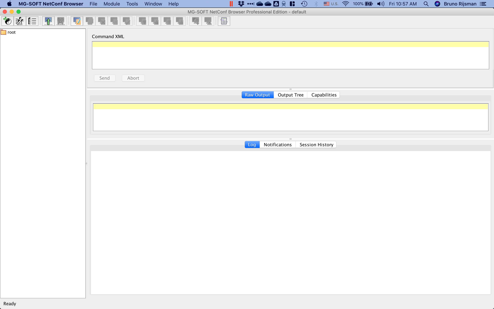
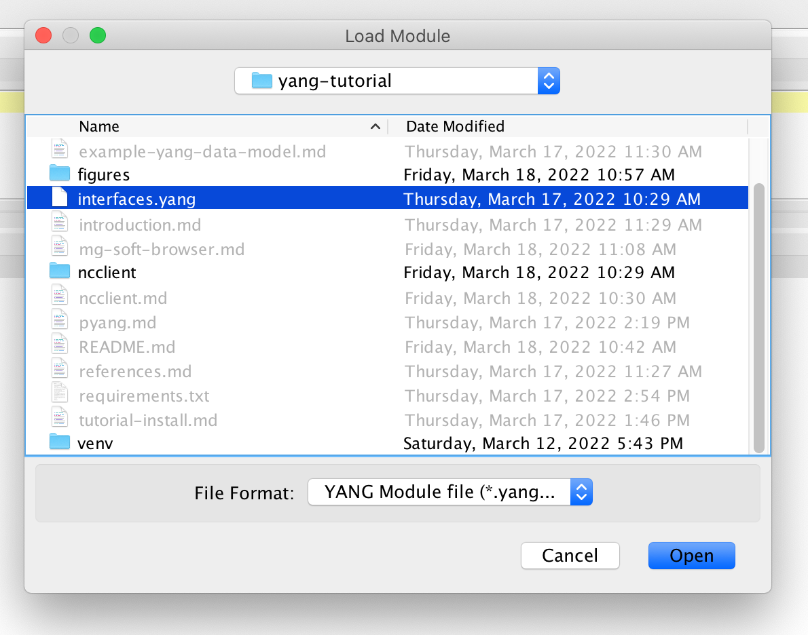
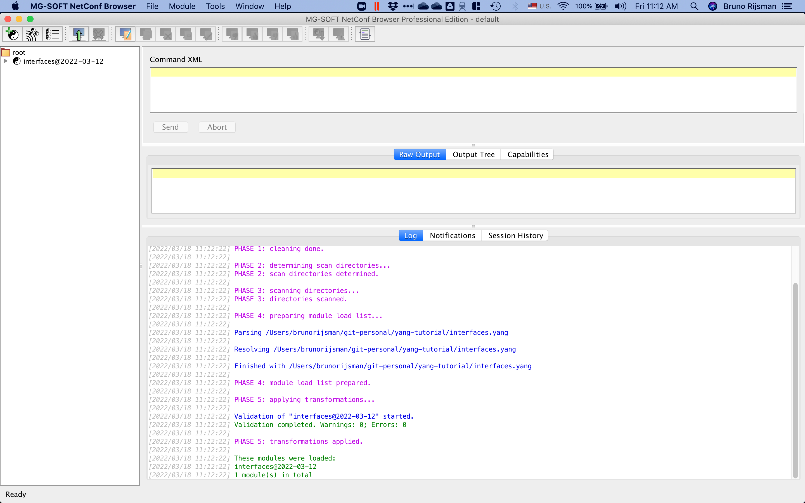
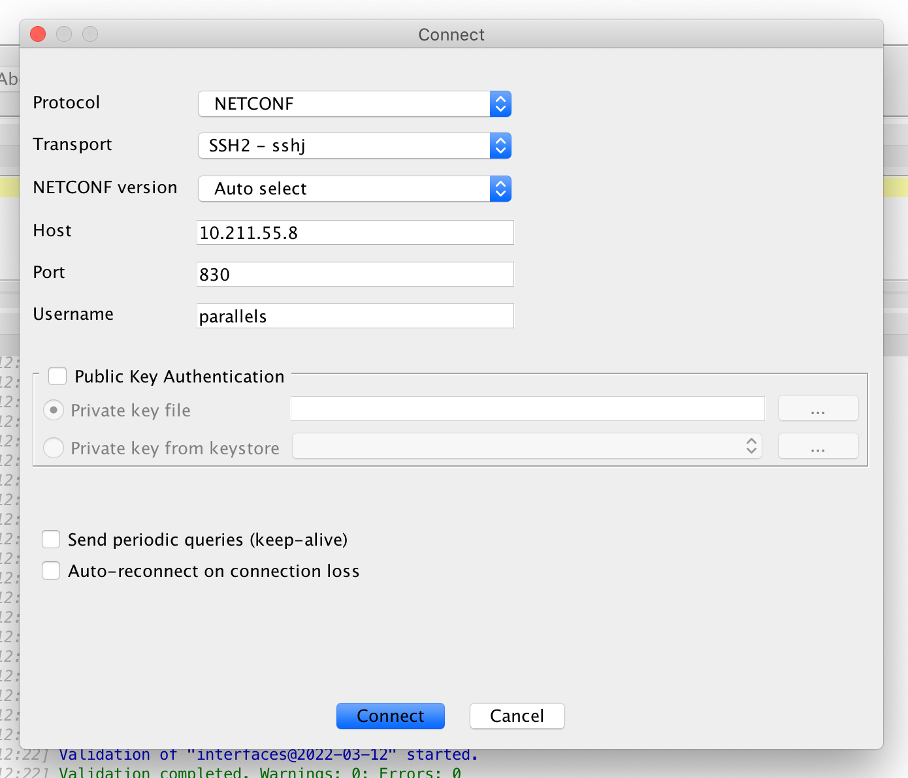
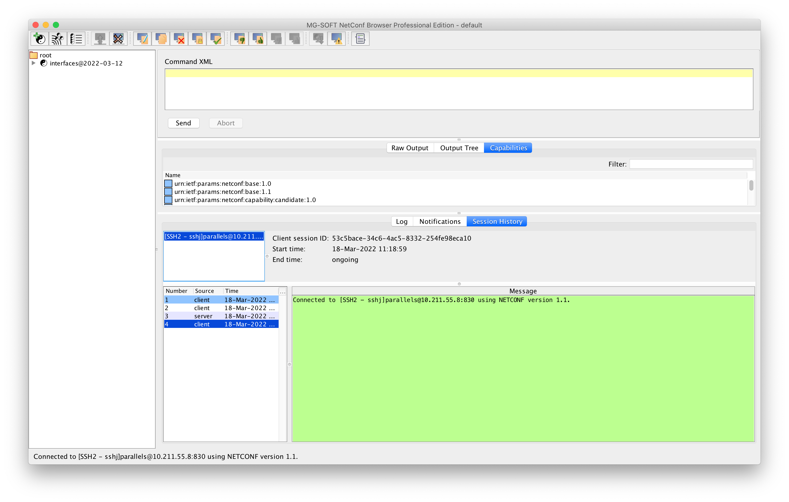
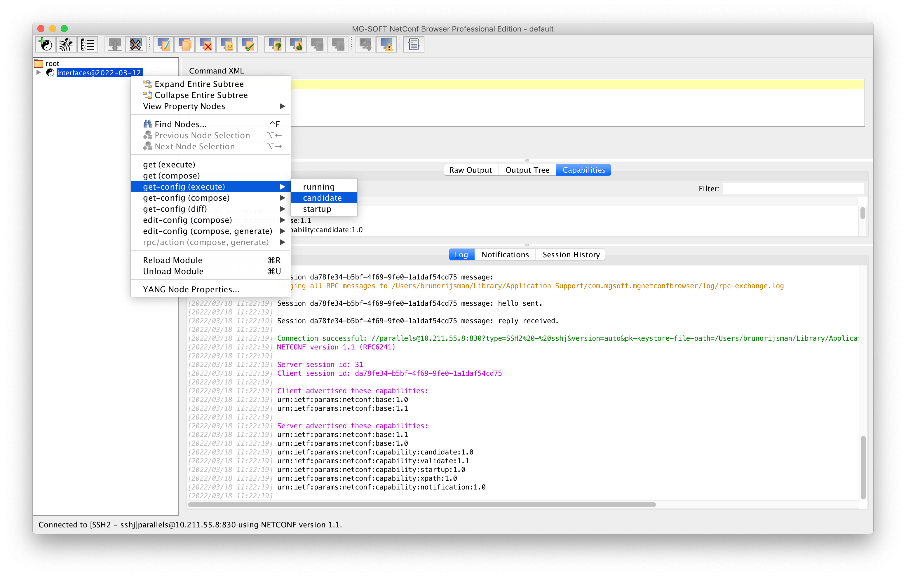

# NETCONF browser from MG-Soft: a commercial NETCONF client with a graphical user interface

## Introduction

[MG-Soft](https://www.mg-soft.si/) is a company that offers a suite of network management related
products.
One of their products, the [NETCONF browser](https://www.mg-soft.si/mgNetConfBrowser.html) is a
NETCONF client that can connect to a NETCONF server and that offers a graphical user interface
for exploring and editing the data store in the NETCONF server.

## Download and install NETCONF browser

You can download the NETCONF browser from the 
[download page](https://www.mg-soft.si/download.html?product=netconfbrowser)
on the MG-Soft website.

MG-Soft offers a version of the NETCONF browser that runs natively on Linux, but I find it more
convenient to run the macOS version of the NETCONF browser and connect to the NETCONF server that
runs inside my Ubuntu virtual machine over the bridge network.

To do anything interesting with the NETCONF browser, you will need to apply a license key.
You can [purchase a license online](https://www.mg-soft.si/mgNetConfBrowser-ordering.html)
or you can [request a 30-day evaluation license online](https://www.mg-soft.si/evalKeyReq.html).
Note: I am not affiliated with MG-Soft in any way and I don't get any commission.

## Start the clixon NETCONF server

The NETCONF browser is a NETCONF client, so we need a NETCONF server to be running.
We will use clixon as the NETCONF server.
Refer to the [clixon chapter in this tutorial](clixon.md) for instructions on how install clixon,
how to build clixon, how the start the clixon backend daemon, and how to configure SSH to start
the clixon NETCONF server.

As a quick sanity check to make sure the NETCONF server is running properly,
manually start an SSH session. You should see a NETCONF `hello` message from the server:

<pre>
$ <b>ssh localhost -s netconf</b>
username@localhost's password: <b>******</b>
<hello xmlns="urn:ietf:params:xml:ns:netconf:base:1.0" message-id="42"><capabilities><capability>urn:ietf:params:netconf:base:1.1</capability><capability>urn:ietf:params:netconf:base:1.0</capability><capability>urn:ietf:params:netconf:capability:candidate:1.0</capability><capability>urn:ietf:params:netconf:capability:validate:1.1</capability><capability>urn:ietf:params:netconf:capability:startup:1.0</capability><capability>urn:ietf:params:netconf:capability:xpath:1.0</capability><capability>urn:ietf:params:netconf:capability:notification:1.0</capability></capabilities><session-id>4</session-id></hello>]]>]]>
</pre>

Type Control-D to exit the SSH session.

# Load the YANG data model into NETCONF browser

When you start the NETCONF browser for the first time, you get the following screen:

If you haven't already done so, apply your license key using the Help → Apply License Key... menu
item.

The first thing we have to do is to load our `interfaces.yang` YANG data model into the
NETCONF browser.
Select the Module → Load Module... menu item, and open the `interfaces.yang` file in this
repository.

The `interfaces` YANG module appears in the left pane of the NETCONF browser.

# Connect to the NETCONF server

To connect ot the clixon NETCONF server, select the File → Connect... menu item and enter 

Note: until recently clixon had a bug that prevented it from interoperating with clients running
NETCONF version 1.1 (see [clixon issue #314](https://github.com/clicon/clixon/issues/314)).
The symptom is that the clixon server stops responding after the initial hello message.
By the time you are reading this tutorial, that bug should already have been fixed, but if not,
you can work around the issue by selecting NETCONF version → 1.0 in the connect screen.

If you click on the Session History tab, you can see that the session is connected.

# Retrieve the configuration

To retrieve the current candidate configuration (for example), right-click on the interfaces
module, and then select get config (execute) → candidate.

